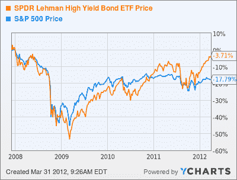
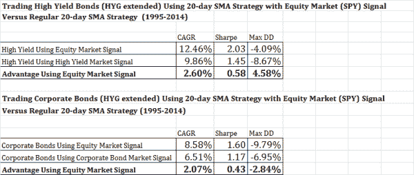

<!--yml
category: 未分类
date: 2024-05-12 17:52:12
-->

# Predicting Bonds with Stocks: A Strategy to Improve Timing in Corporate and High Yield Bonds | CSSA

> 来源：[https://cssanalytics.wordpress.com/2014/10/30/predicting-bonds-with-stocks-a-strategy-to-improve-timing-in-corporate-and-high-yield-bonds/#0001-01-01](https://cssanalytics.wordpress.com/2014/10/30/predicting-bonds-with-stocks-a-strategy-to-improve-timing-in-corporate-and-high-yield-bonds/#0001-01-01)

Alpha Architect recently posted a good [article summary](http://www.alphaarchitect.com/blog/2014/10/28/predict-stocks-with-bond-markets/#.VFEAU_nF-VJ) of an academic paper that links the returns of corporate bonds to equity returns. The authors find that the equity market can lead corporate bond returns by up to one month. I have explored this concept before on the premise that there is a logical linkage between stocks and corporate bonds (and high yield) since they share vulnerability to common economic factors (growth, credit risk etc). Since stocks are far more liquid than corporate or high yield bonds, it makes sense that the stock market should have a leading signal.

As a simple test to demonstrate the potential value of this leading signal, one can compare a simple moving average strategy that uses the stock market to time either corporate or high yield bonds versus using the underlying market to generate the signal. The hypothesis would be that the stock or equity market signal should generate superior results to using a traditional moving average strategy using the underlying time series. Furthermore, we would hypothesize that the advantage should be superior relatively speaking for high yield bonds versus corporate bonds since they have more similar economic factor risk to equities (investment grade corporates are to some extent correlated to economic growth and credit risk, but also have greater interest rate sensitivity given the ratio of their credit spread to the total nominal yield). In addition, this effect is further enhanced by the fact that high yield bonds have lower liquidity than corporate bonds given that they tend to be issued by smaller/less diversified companies. This means that the lead/lag relationship between equities and high yield should be longer and more stable than for corporate bonds.

For our simple test, we use a 20-day moving average strategy to trade either High Yield (HYG) or Corporate Bonds (LQD) using either the underlying time series to generate signals or the S&P500 (SPY) to represent equity market signals. As with most SMA strategies, we go long if the close is above the SMA and in this case we allocate to cash (SHY) below the SMA. Here are the results extending the bond indices back to 1995:

Results are very much in line with both hypotheses: the equity market is a superior signal than using the underlying time series, and the advantage in applying this effect is stronger in high yield bonds versus using corporate bonds. The reduction in drawdown, and increase in risk-adjusted returns using the equity market signal to trade high yield bonds is substantial. As a note of caution, this analysis does not consider relative trading costs, but one would expect a similar number of total trading signals regardless of which market is used since they are exposed to similar risk factors and also use the same moving average lag. The lesson for quants is that it often helps to pay attention to the fundamental drivers of a market’s underlying return rather than applying naaive technical trading rules.