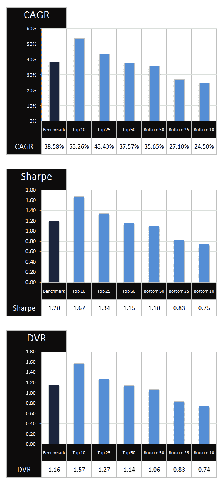
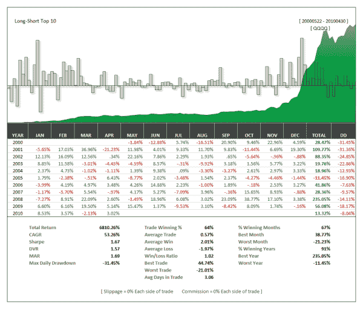

<!--yml
category: 未分类
date: 2024-05-12 18:27:23
-->

# Predicting the Market From the Inside Out: Adaptive Breadth | CSSA

> 来源：[https://cssanalytics.wordpress.com/2010/05/05/predicting-the-market-from-the-inside-out-adaptive-breadth/#0001-01-01](https://cssanalytics.wordpress.com/2010/05/05/predicting-the-market-from-the-inside-out-adaptive-breadth/#0001-01-01)

I had a lightbulb moment several weeks ago in which I theorized that certain stocks within the index were more likely to be the “drivers” of index returns than others. Different variables such as volume activity and others may be able to help separate which stocks were useful for predicting index returns versus those that were not. The only way to really tell if such a ranking has any power is to do a “walk-forward” test in which stocks are selected each day as “predictors” of the QQQQ by use of the DV2 indicator. **Effectively a signal is created from this group to trade the QQQQ**. As it turns out, the methodology appears quite powerful–a near linear increase in absolute and risk-adjusted returns by rank. Using the Top 10 stocks to create an adaptive breadth index (averaging the dv2 values of the top stocks) to trade long .5 significantly outperformed using the DV2 on the QQQQ alone (the benchmark). Unlike standard breadth indicators where theories and fables abound concerning how to best apply them, this method is more “assumption free.” As **Jeff Pietsch** of **Market Rewind** likes to say: “Markov would be proud!”

### Using an Adaptive Rank To Determine Which Nasdaq 100 Stocks Best Predict The QQQQ with the DV2 Indicator

Backtest from 5/22/2000 to 4/30/2010 [2500 Bars]
Benchmark = Long QQQQ DV2 < .50 — Short QQQQ DV2 > .50

