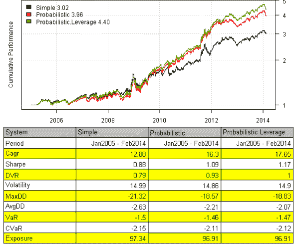
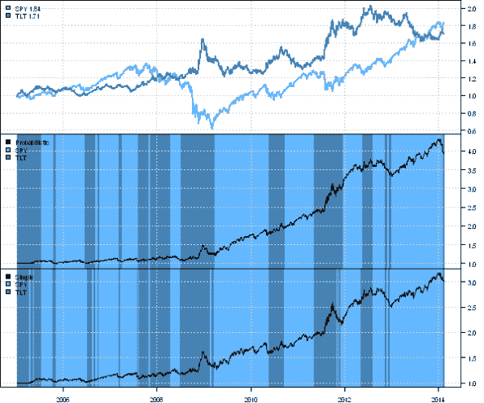

<!--yml
category: 未分类
date: 2024-05-18 14:30:56
-->

# Probabilistic Momentum | Systematic Investor

> 来源：[https://systematicinvestor.wordpress.com/2014/02/17/probabilistic-momentum/#0001-01-01](https://systematicinvestor.wordpress.com/2014/02/17/probabilistic-momentum/#0001-01-01)

[David Varadi](http://cssanalytics.wordpress.com) has recently discussed an interesting strategy in the
[Are Simple Momentum Strategies Too Dumb? Introducing Probabilistic Momentum](http://cssanalytics.wordpress.com/2014/01/28/are-simple-momentum-strategies-too-dumb-introducing-probabilistic-momentum/) post. David also provided the [Probabilistic Momentum Spreadsheet](http://cssanalytics.wordpress.com/2014/02/12/probabilistic-momentum-spreadsheet/) if you are interested in doing computations in Excel. Today I want to show how you can test such strategy using the [Systematic Investor Toolbox](https://systematicinvestor.wordpress.com/systematic-investor-toolbox/):

```

###############################################################################
# Load Systematic Investor Toolbox (SIT)
# https://systematicinvestor.wordpress.com/systematic-investor-toolbox/
###############################################################################
setInternet2(TRUE)
con = gzcon(url('http://www.systematicportfolio.com/sit.gz', 'rb'))
    source(con)
close(con)
	#*****************************************************************
	# Load historical data
	#****************************************************************** 
	load.packages('quantmod')

	tickers = spl('SPY,TLT')

	data <- new.env()
	getSymbols(tickers, src = 'yahoo', from = '1980-01-01', env = data, auto.assign = T)
		for(i in ls(data)) data[[i]] = adjustOHLC(data[[i]], use.Adjusted=T)
	bt.prep(data, align='remove.na', dates='2005::')

	#*****************************************************************
	# Setup
	#****************************************************************** 
	lookback.len = 60

	prices = data$prices

	models = list()

	#*****************************************************************
	# Simple Momentum
	#****************************************************************** 
	momentum = prices / mlag(prices, lookback.len)
	data$weight[] = NA
		data$weight$SPY[] = momentum$SPY > momentum$TLT
		data$weight$TLT[] = momentum$SPY <= momentum$TLT
	models$Simple  = bt.run.share(data, clean.signal=T) 	

```

The Simple Momentum strategy invests into SPY if SPY’s momentum if greater than TLT’s momentum, and invests into TLT otherwise.

```

	#*****************************************************************
	# Probabilistic Momentum
	#****************************************************************** 
	confidence.level = 60/100
	ret = prices / mlag(prices) - 1 

	ir = sqrt(lookback.len) * runMean(ret$SPY - ret$TLT, lookback.len) / runSD(ret$SPY - ret$TLT, lookback.len)
	momentum.p = pt(ir, lookback.len - 1)

	data$weight[] = NA
		data$weight$SPY[] = iif(cross.up(momentum.p, confidence.level), 1, iif(cross.dn(momentum.p, (1 - confidence.level)), 0,NA))
		data$weight$TLT[] = iif(cross.dn(momentum.p, (1 - confidence.level)), 1, iif(cross.up(momentum.p, confidence.level), 0,NA))
	models$Probabilistic  = bt.run.share(data, clean.signal=T) 	

```

The [Probabilistic Momentum](http://cssanalytics.wordpress.com/2014/01/28/are-simple-momentum-strategies-too-dumb-introducing-probabilistic-momentum/) strategy is using Probabilistic Momentum measure and Confidence Level to decide on allocation. Strategy invests into SPY if SPY vs TLT [Probabilistic Momentum](http://cssanalytics.wordpress.com/2014/01/28/are-simple-momentum-strategies-too-dumb-introducing-probabilistic-momentum/) is above Confidence Level and invests into TLT is SPY vs TLT [Probabilistic Momentum](http://cssanalytics.wordpress.com/2014/01/28/are-simple-momentum-strategies-too-dumb-introducing-probabilistic-momentum/) is below 1 – Confidence Level.

To make Strategy a bit more attractive, I added a version that can leverage SPY allocation by 50%

```

	#*****************************************************************
	# Probabilistic Momentum + SPY Leverage 
	#****************************************************************** 
	data$weight[] = NA
		data$weight$SPY[] = iif(cross.up(momentum.p, confidence.level), 1, iif(cross.up(momentum.p, (1 - confidence.level)), 0,NA))
		data$weight$TLT[] = iif(cross.dn(momentum.p, (1 - confidence.level)), 1, iif(cross.up(momentum.p, confidence.level), 0,NA))
	models$Probabilistic.Leverage = bt.run.share(data, clean.signal=T) 	

	#*****************************************************************
	# Create Report
	#******************************************************************    
	strategy.performance.snapshoot(models, T)

```

[](https://systematicinvestor.wordpress.com/wp-content/uploads/2014/02/plot1.png)

The back-test results look very similar to the ones reported in the [Are Simple Momentum Strategies Too Dumb? Introducing Probabilistic Momentum](http://cssanalytics.wordpress.com/2014/01/28/are-simple-momentum-strategies-too-dumb-introducing-probabilistic-momentum/) post.

However, I was not able to exactly reproduce the transition plots. Looks like my interpretation is producing more whipsaw when desired.

```

	#*****************************************************************
	# Visualize Signal
	#******************************************************************        
	cols = spl('steelblue1,steelblue')
	prices = scale.one(data$prices)

	layout(1:3)

	plota(prices$SPY, type='l', ylim=range(prices), plotX=F, col=cols[1], lwd=2)
	plota.lines(prices$TLT, type='l', plotX=F, col=cols[2], lwd=2)
		plota.legend('SPY,TLT',cols,as.list(prices))

	highlight = models$Probabilistic$weight$SPY > 0
		plota.control$col.x.highlight = iif(highlight, cols[1], cols[2])
	plota(models$Probabilistic$equity, type='l', plotX=F, x.highlight = highlight | T)
		plota.legend('Probabilistic,SPY,TLT',c('black',cols))

	highlight = models$Simple$weight$SPY > 0
		plota.control$col.x.highlight = iif(highlight, cols[1], cols[2])
	plota(models$Simple$equity, type='l', plotX=T, x.highlight = highlight | T)
		plota.legend('Simple,SPY,TLT',c('black',cols))	

```

[](https://systematicinvestor.wordpress.com/wp-content/uploads/2014/02/plot2.png)

[David](http://cssanalytics.wordpress.com) thank you very much for sharing your great ideas. I would encourage readers to play with this strategy and report back.

To view the complete source code for this example, please have a look at the [bt.probabilistic.momentum.test() function in bt.test.r at github](https://github.com/systematicinvestor/SIT/blob/master/R/bt.test.r).