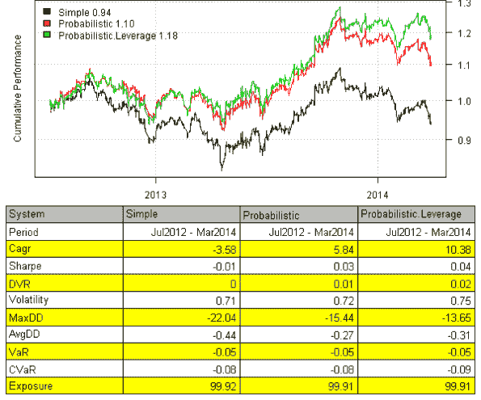
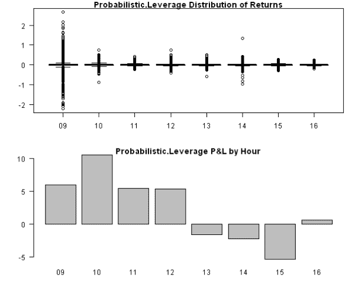
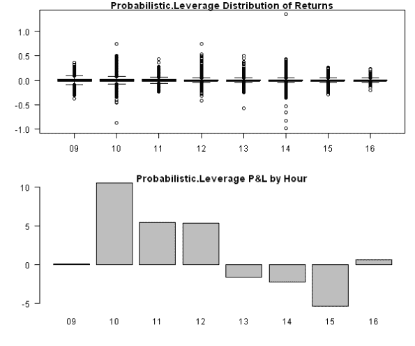

<!--yml
category: 未分类
date: 2024-05-18 14:30:35
-->

# Probabilistic Momentum with Intraday data | Systematic Investor

> 来源：[https://systematicinvestor.wordpress.com/2014/03/31/probabilistic-momentum-with-intraday-data/#0001-01-01](https://systematicinvestor.wordpress.com/2014/03/31/probabilistic-momentum-with-intraday-data/#0001-01-01)

I want to follow up the [Intraday data](https://systematicinvestor.wordpress.com/2014/03/10/intraday-data/) post with testing the [Probabilistic Momentum](https://systematicinvestor.wordpress.com/2014/02/17/probabilistic-momentum/) strategy on Intraday data. I will use Intraday data for SPY and GLD from the [Bonnot Gang](http://thebonnotgang.com/tbg/historical-data/) to test the [strategy](https://systematicinvestor.wordpress.com/2014/02/17/probabilistic-momentum/).

```

##############################################################################
# Load Systematic Investor Toolbox (SIT)
# https://systematicinvestor.wordpress.com/systematic-investor-toolbox/
###############################################################################
setInternet2(TRUE)
con = gzcon(url('http://www.systematicportfolio.com/sit.gz', 'rb'))
    source(con)
close(con)

	#*****************************************************************
	# Load historical data
	#****************************************************************** 
	load.packages('quantmod')	

	# data from http://thebonnotgang.com/tbg/historical-data/
	# please save SPY and GLD 1 min data at the given path
	spath = 'c:/Desktop/'
	data = bt.load.thebonnotgang.data('SPY,GLD', spath)

	data1 <- new.env()		
		data1$FI = data$GLD
		data1$EQ = data$SPY
	data = data1
	bt.prep(data, align='keep.all', fill.gaps = T)

	lookback.len = 120
	confidence.level = 60/100

	prices = data$prices
		ret = prices / mlag(prices) - 1 

	models = list()

	#*****************************************************************
	# Simple Momentum
	#****************************************************************** 
	momentum = prices / mlag(prices, lookback.len)
	data$weight[] = NA
		data$weight$EQ[] = momentum$EQ > momentum$FI
		data$weight$FI[] = momentum$EQ <= momentum$FI
	models$Simple  = bt.run.share(data, clean.signal=T) 	

	#*****************************************************************
	# Probabilistic Momentum + Confidence Level
	# http://cssanalytics.wordpress.com/2014/01/28/are-simple-momentum-strategies-too-dumb-introducing-probabilistic-momentum/
	# http://cssanalytics.wordpress.com/2014/02/12/probabilistic-momentum-spreadsheet/
	#****************************************************************** 
	ir = sqrt(lookback.len) * runMean(ret$EQ - ret$FI, lookback.len) / runSD(ret$EQ - ret$FI, lookback.len)
	momentum.p = pt(ir, lookback.len - 1)

	data$weight[] = NA
		data$weight$EQ[] = iif(cross.up(momentum.p, confidence.level), 1, iif(cross.dn(momentum.p, (1 - confidence.level)), 0,NA))
		data$weight$FI[] = iif(cross.dn(momentum.p, (1 - confidence.level)), 1, iif(cross.up(momentum.p, confidence.level), 0,NA))
	models$Probabilistic  = bt.run.share(data, clean.signal=T) 	

	data$weight[] = NA
		data$weight$EQ[] = iif(cross.up(momentum.p, confidence.level), 1, iif(cross.up(momentum.p, (1 - confidence.level)), 0,NA))
		data$weight$FI[] = iif(cross.dn(momentum.p, (1 - confidence.level)), 1, iif(cross.up(momentum.p, confidence.level), 0,NA))
	models$Probabilistic.Leverage = bt.run.share(data, clean.signal=T) 	

	#*****************************************************************
	# Create Report
	#******************************************************************        
	strategy.performance.snapshoot(models, T)    

```

[](https://systematicinvestor.wordpress.com/wp-content/uploads/2014/03/plot11.png)

Next, let’s examine the hourly perfromance of the [strategy](https://systematicinvestor.wordpress.com/2014/02/17/probabilistic-momentum/).

```

	#*****************************************************************
	# Hourly Performance
	#******************************************************************    
	strategy.name = 'Probabilistic.Leverage'
	ret = models[[strategy.name]]$ret	
		ret.number = 100*as.double(ret)

	dates = index(ret)
	factor = format(dates, '%H')

	layout(1:2)
	par(mar=c(4,4,1,1))
	boxplot(tapply(ret.number, factor, function(x) x),outline=T, main=paste(strategy.name, 'Distribution of Returns'), las=1)
	barplot(tapply(ret.number, factor, function(x) sum(x)), main=paste(strategy.name, 'P&L by Hour'), las=1)

```

[](https://systematicinvestor.wordpress.com/wp-content/uploads/2014/03/plot21.png)

There are lots of abnormal returns in the 9:30-10:00am box due to big overnight returns. I.e. a return from today’s open to prior’s day close. If we exclude this observation every day, the distribution each hour is more consistent.

```

   	#*****************************************************************
   	# Hourly Performance: Remove first return of the day (i.e. overnight)
   	#******************************************************************    
   	day.stat = bt.intraday.day(dates)
	ret.number[day.stat$day.start] = 0

   	layout(1:2)
   	par(mar=c(4,4,1,1))
	boxplot(tapply(ret.number, factor, function(x) x),outline=T, main=paste(strategy.name, 'Distribution of Returns'), las=1)
	barplot(tapply(ret.number, factor, function(x) sum(x)), main=paste(strategy.name, 'P&L by Hour'), las=1)

```

[](https://systematicinvestor.wordpress.com/wp-content/uploads/2014/03/plot31.png)

The [strategy](https://systematicinvestor.wordpress.com/2014/02/17/probabilistic-momentum/) performs best in the morning and dwindles down in the afternoon and overnight.

These hourly seasonality plots are just a different way to analyze performance of the strategy based on Intraday data.

To view the complete source code for this example, please have a look at the [bt.strategy.intraday.thebonnotgang.test() function in bt.test.r at github](https://github.com/systematicinvestor/SIT/blob/master/R/bt.test.r).