<!--yml
category: 未分类
date: 2024-05-17 23:31:46
-->

# Probability Distribution of the Heston Model, Part I – HPC-QuantLib

> 来源：[https://hpcquantlib.wordpress.com/2014/02/04/probability-distribution-of-the-heston-model-part-i/#0001-01-01](https://hpcquantlib.wordpress.com/2014/02/04/probability-distribution-of-the-heston-model-part-i/#0001-01-01)

The Heston model is defined by the following stochastic differential equation of the log spot 

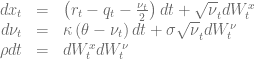

To a significant extent the popularity of the Heston model is based on the fact that semi-closed formulas for vanilla European options exist using the characteristic function of the model. The time evolution of the probability density function 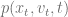 is given by the corresponding Fokker-Planck equation [1]

with the initial condition

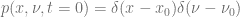

The reduced probability density function

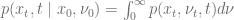

for this initial value problem can be calculated using a semi-closed integral formula [2]

![\begin{array}{rcl} \Gamma &=& \kappa+i\rho\sigma p_x \\ \Omega &=& \sqrt{\Gamma^2 + \sigma^2\left(p_x^2-ip_x \right )} \\ p(x_t, t \mid \nu_0) &=& \int_{-\infty}^\infty \frac{dp_x}{2\pi}\exp\left( ip_x (x_t-x_0 -(r-q)t) -\nu_0 \frac{p_x^2-ip_x}{\Gamma + \Omega \coth\left(\Omega t/2 \right )} \right) \\ && \ \ \ \ \ \ \ \ \times \exp\left(-\frac{2\theta\kappa}{\sigma^2}\ln\left(\cosh\frac{\Omega t}{2} + \frac{\Gamma}{\Omega} \sinh \frac{\Omega t}{2}\right )+\frac{\kappa\Gamma\theta t}{\sigma^2} \right) \\ &=& \int_{-\infty}^\infty \frac{dp_x}{2\pi} \tilde{p}(p_x,t \mid \nu_0) \end{array} ](img/a0e49ce51c2300075a03113c80341f10.png)

This gives the opportunity to write a pricing engine for arbitrary European payoffs. The value of an European option with payoff function 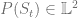 at maturity  is given by

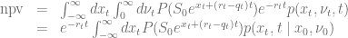

The calculation needs two nested integrations which can be carried out efficiently using e. g. the Gauss-Lobatto algorithm. The solution of the equation

determines the upper boundary for the integration over 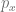. The boundaries ![\left[ -x_{min}, x_{max}\right]](img/af88cd3b4874253b43d38bd4a82f60d4.png) for the integration over 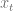 are chosen such that the interval covers ten times the expected variance

![-x_{min} = x_{max}=10\sqrt{\int_0^{t}E\left[ \nu_t \right ] dt} = 10\sqrt{\theta t + \frac{1}{\kappa}\left(\nu_0-\theta\right)\left(1-e^{-\kappa t}\right)} ](img/15e9152f288eefbbe042d319860f3014.png)

Obviously the nested integration makes this algorithm more tricky than the standard ways to price plain vanilla European options but it is not limited to vanilla payoffs. The implementation of this algorithm can be found [here](https://github.com/lballabio/quantlib/blob/master/QuantLib/ql/experimental/exoticoptions/analyticpdfhestonengine.cpp) within the [QuantLib trunk on Github.](https://github.com/lballabio/quantlib)

Broadie and Kaya [1] have outlined an algorithm to sample from the full probability density function 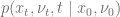 instead of the reduced density function 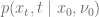. Starting point for this algorithm is the exact solution of the Heston stochastic differential equation

The probability density function of the variance process 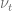 is given by a noncentral chi-squared distribution

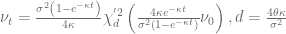

The distribution 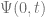 of the integral 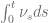 conditional on  and 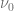 can be calculated via the characteristic function

![\begin{array}{rcl} \text{Pr}(\Psi(t) \le x)&=& \frac{2}{\pi}\int_0^\infty \frac{\sin ux}{u}\text{Re}(\Phi(u)) du \\ \\ \Phi(a)&=& \frac{\gamma(a)e^{-\frac{1}{2}(\gamma(a)-\kappa)t} \left(1-e^{-\kappa t}\right)} {\kappa\left(1-e^{\gamma(a)t}\right)} \exp\left( \frac{\nu_t+\nu_0}{\sigma^2} \left[ \frac{\kappa\left(1+e^{-\kappa t}\right)}{1-e^{-\kappa t}} - \frac{\gamma(a)\left(1+e^{-\gamma(a)t}\right)}{1-e^{-\gamma(a)t}} \right] \right) \\ && \times \frac{I_{0.5d-1} \left( \sqrt{\nu_0\nu_t} \frac{4\gamma (a) e^{-0.5\gamma(a)t}}{\sigma^2\left(1-e^{-\gamma(a)t}\right)}\right)}{ I_{0.5d-1} \left( \sqrt{\nu_0\nu_t} \frac{4\kappa e^{-0.5\kappa t}}{\sigma^2\left(1-e^{-\kappa t}\right)}\right)} \\ && \times \frac{\exp\left((0.5d-1) \left[-\frac{1}{2}\gamma(a)t + \ln \frac{\gamma(a)}{1-e^{-\gamma(a)t}} \right]\right)}{\left(\frac{\gamma(a) e^{-0.5\gamma(a)t} }{ 1-e^{-\gamma(a)t}}\right)^{0.5d-1}} \\ \\ \gamma(a)&=&\sqrt{\kappa^2-2 i \sigma^2 a} \end{array} ](img/e6f33792cf83abd053d4dab3d5e29c73.png)

The modified Bessel function of first kind 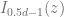 can be evaluated using series expansion for small and medium  or asymptotic approximation for large  [5]. Unfortunately Boost provides only real versions of the Bessel functions and the copyright status of older complex valued Fortran77 routine is vague. Therefore QuantLib comes with its own [implementation](https://github.com/lballabio/quantlib/blob/master/QuantLib/ql/math/modifiedbessel.cpp).

Please notice that 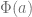 is already a continuous version of the characteristic function and therefore the integration does not need to track the branches of 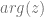 when calculating the complex valued Bessel function [4].

The integration over the characteristic function is best done using either Gauss-Laguerre, Gauss-Lobatto or trapezoidal rule. The two later algorithms need to truncate the integration at some upper bound. First guess for a truncation limit can be taken from the [Cornish-Fisher expansion](http://en.wikipedia.org/wiki/Cornish%E2%80%93Fisher_expansion)  for some very small 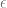. The moment-generating function  can be used to get the first, second and third moment of the distribution via finite difference quotient.

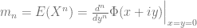

The next term is now fairly easy to calculate

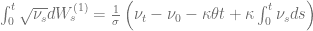

The log spot process can now be sampled using a standard normal random variable  and

This sampling algorithm is exact even for very large time steps and therefore gives some advantages for quasi random Monte-Carlo methods but the inversion of the integration of the characteristic function is also very slow. The algorithm is implemented within the [HestonProcess](https://github.com/lballabio/quantlib/blob/master/QuantLib/ql/processes/hestonprocess.cpp) class.

[1] I. Clark, [Foreign Exchange Option Pricing: A Practitioners Guide](http://books.google.de/books?id=7vua-0-2sgMC&pg=PT130&lpg=PT130&dq=heston+model+fokker+planck+equation&source=bl&ots=nHutgX1qSu&sig=2FFDK3WVot5LSxBldfE5VoYCZKc&hl=de&sa=X&ei=R_3kUvDpBoWEtAb0xIHYAQ&ved=0CEwQ6AEwAg#v=onepage&q=heston%20model%20fokker%20planck%20equation&f=false), p. 113

[2] A. Dragulescu, V. Yakovenko, [Probability distribution of returns in the Heston model with stochastic volatility](http://arxiv.org/pdf/cond-mat/0203046.pdf)

[3] M. Broadie, Ö. Kaya, [Exact Simulation of Stochastic Volatility and other Affine Jump Diffusion Processes](http://finmath.stanford.edu/seminars/documents/Broadie.pdf)

[4] R. Lord, [Efficient pricing algorithms for exotic derivatives](http://www.google.de/url?sa=t&rct=j&q=&esrc=s&source=web&cd=3&ved=0CDwQFjAC&url=http%3A%2F%2Frepub.eur.nl%2Fpub%2F13917%2FLordR-Thesis.pdf&ei=49nwUsreLYjnswbZ2IHIDQ&usg=AFQjCNFWjTcnOft7cgo_0q-VDDhUaS1YUA&bvm=bv.60444564,d.Yms), p. 40

[5] J.R. Culham, [Bessel Functions of the First and Second Kind](http://www.mhtlab.uwaterloo.ca/courses/me755/web_chap4.pdf)