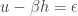
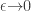
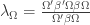
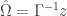

<!--yml
category: 未分类
date: 2024-05-18 13:42:54
-->

# Proxy / Cross Hedging | Quantivity

> 来源：[https://quantivity.wordpress.com/2011/10/02/proxy-cross-hedging/#0001-01-01](https://quantivity.wordpress.com/2011/10/02/proxy-cross-hedging/#0001-01-01)

The root challenge of two current equity risk and alpha projects boil down to hedging using non-underlying instruments, known as *proxy hedging* or *cross hedging*. This technique is useful for *equity shaping* trades, as well as an underlying principle for both long / short and statarb:

*   **Price exposure**: neutralize price exposure for stock or basket, possibly leaving behind useful residual (such as dividends or rights)
*   **Market exposure**: neutralize market exposure for a stock or basket, leaving just idiosyncratic exposure

Trading these hedges in practice is more difficult than standard texts suggest (*e.g.* [Hull](http://books.google.com/books?id=sEmQZoHoJCcC)), as the real world rarely satisfies theory: market incompleteness (challenging risk-neutral  models), stochastic covariation (challenging static models), and non-linear impulse response (challenging linear models).

This challenge is explored here via a multi-part series (see [Empirical Quantiles and Proxy Selection](https://quantivity.wordpress.com/2011/10/03/empirical-quantiles-proxy-cross-hedging-selection), [Empirical Copulas and Hedge Basis Risk](https://quantivity.wordpress.com/2011/10/10/empirical-copulas-and-proxy-cross-hedge-basis-risk), [Lag Dynamics with Autocopulas](https://quantivity.wordpress.com/2011/10/16/lag-dynamics-with-autocopulas), [Exploratory Hedge Analysis](https://quantivity.wordpress.com/2011/10/22/exploratory-proxy-cross-hedge-analysis), [Proxy Hedging and Dependence](https://quantivity.wordpress.com/2011/10/26/proxy-cross-hedge-correlation-dependence/), and [Proxy Conditional Model Selection](https://quantivity.wordpress.com/2011/10/30/proxy-cross-hedge-conditional-model-selection)), including R code and real data. This first post presents the basic model. The second post will apply this model to a few well-known equities. Readers are *encouraged to comment on improvements or alternative techniques* on all posts, as this problem is real and remains an open research topic.

**Proxy Hedge Model**

Begin with the textbook mathematical model. This *proxy hedge model* is composed of two instruments  and , long underlying and short hedge respectively, whose weighted sum generates a residual :

   

Where the hedge ratio  determines the proportional amount of hedge  per unit underlying . Although not modeled explicitly, the *joint relationship* of both sign and magnitude between  and  is important and represented as  (*i.e.* correlation, but more generally copula). Both  and  are time-series whose values are stochastic with unknown distributions.

The purpose of this model is to *shape the residual* to generate P&L on the trade, also known as the *basis risk*. A  means price exposure to  is neutralized. When  is a market index, non-zero  is equivalent to neutralizing market exposure and leaving idiosyncratic exposure specific to  (an [exotic beta](https://quantivity.wordpress.com/2011/09/29/you-dont-have-alpha), of sorts). In both cases, the behavior of  is asymptotic on the  measure. Traditionally, futures were the preferred instrument for . More recently, ETFs are becoming increasingly interesting given their diversity (including [levers](https://quantivity.wordpress.com/2009/08/11/lever-options-gamma-decay)).

Although the math is pedestrian, it belies two serious research challenges:

*   **Instrument selection**: choice of instrument for 
*   **Ratio calculation**: choice of algorithm to calculate 

Both are explored below.

**Instrument Selection**

Deciding the universe of  instruments to explore is more art than science given hedges are assumed, by definition, to not be derivatives on . Hence, the standard  machinery is unavailable. Thus, significant exploratory analysis on the marginal and joint behavior of  and  is warranted.

One traditional answer is to seek out instruments which maximize Pearson correlation . This turns out to be fairly naïve: despite  expressing a linear relationship, that does not necessarily imply measurement of the – relationship should be constrained to linearity (as Pearson expresses only linear sensitivity). A better answer is to follow economic intuition and identify instruments which have strong fundamental reasons why they covary.

**Ratio Calculation**

Techniques for calculating  have been subject to intense research over recent decades. Two recent summary articles are [de Prado and Leinweber (2011)](http://papers.ssrn.com/sol3/papers.cfm?abstract_id=1906489) and [Alexander and Barbosa (2007)](http://www.carolalexander.org/publish/download/JournalArticles/PDFs/JPM_33_2_46-59.pdf).

For analysis here, the Box-Tiao Canonical Decomposition (BTCD) method from de Prado (2011) is selected. In short, this approach maximizes a measure of predictability generalized from [Box and Tiao (1977)](http://biomet.oxfordjournals.org/content/64/2/355.abstract) on the combined portfolio of  and :

   

Whose solution based upon a generalized [Rayleigh quotient](http://en.wikipedia.org/wiki/Rayleigh_quotient) form, in , is:

   

This method is particularly useful as it permits use of an *arbitrary forecasting model*, instead of limiting explanatory variables to forecast variables lagged by a single period (as is common with standard techniques).

The following is R code for BTCD using a standard [vector autoregression](http://en.wikipedia.org/wiki/Vector_autoregression) (VAR) forecasting model (with [Ledoit and Wolf (2004)](http://www.ledoit.net/ole1a.pdf) covariance shrinkage), with minor simplification from the derivation provided in de Prado (p. 8):

```

require("vars")
require("tawny")

btcdHedge <- function(p, start=1, interval=4)
{
  # Generate hedge using BTCD method, as defined by de Prado [2011].
  #
  # Args:
  #   p: matrix of instrument price data
  #   start: index into p, which to begin generating hedge
  #   interval: number of periods used to calibrate hedge
  #
  # Returns: BTCD hedge ratio vector

  end <- start+interval
  pvar <- VAR(p[start:end,], p=1, type="none")

  varfit <- fitted(pvar)
  B <- cov.shrink(p)        # shrink covariance
  A <- t(varfit) %*% varfit

  C <- chol(B)
  CInv <- solve(C)
  D <- t(CInv) %*% A %*% CInv
  eigens <- eigen(D)
  z <- eigens$vectors[,length(eigens$values)]
  x <- CInv %*% z
  hedge <- x/x[1]

  # perform sanity check
  tx <- t(x)
  num <- tx %*% A %*% x
  denom <- tx %*% B %*% x
  check <- num / denom
  if ((check - eigens$values[length(eigens$values)]) > 0.0001)
  {
    message("failed sanity check")
  }

  return (hedge)
}

```

This algorithm requires input of the duration of preceding contiguous time window over which the hedge is calculated, via the `interval` argument. As with any window-based algorithm, the interval represents a tradeoff: shorter intervals are more responsible, but more noisy; longer intervals are smoother, but less responsive. Thus, selection of interval length is more art than science.