<!--yml
category: 未分类
date: 2024-05-18 13:45:50
-->

# Proxy Conditional Model Selection | Quantivity

> 来源：[https://quantivity.wordpress.com/2011/10/30/proxy-cross-hedge-conditional-model-selection/#0001-01-01](https://quantivity.wordpress.com/2011/10/30/proxy-cross-hedge-conditional-model-selection/#0001-01-01)

[Lag Dynamics with Autocopulas](https://quantivity.wordpress.com/2011/10/16/lag-dynamics-with-autocopulas) investigated autocopulas for underlying and hedge instruments as applied to [proxy / cross hedging](https://quantivity.wordpress.com/2011/10/02/proxy-cross-hedging), concluding the existence of *large-magnitude temporal volatility clustering*. This is indeed a known stylized fact of financial returns (see [Tsay 2010](http://books.google.com/books?id=OKUGARAXKMwC), Chapters 2 and 3).

The classic *discrete-time* models for capturing such *statistical conditionality* are [ARMA](http://en.wikipedia.org/wiki/Autoregressive%E2%80%93moving-average_model) (see [Box *et. al* (1994)](http://books.google.com/books?id=lJnnPQAACAAJ)) and [GARCH](http://en.wikipedia.org/wiki/Autoregressive_conditional_heteroskedasticity#GARCH) (see [Engle (1982)](http://www.jstor.org/pss/1912773) and [Bollerslev (1986)](http://www.sciencedirect.com/science/article/pii/0304407686900631)), for returns and volatility respectively. Yet, therein lies a practical problem faced by hedge analysis: *necessity to select a model with optimal parameters and error distribution for underlying and hedge*. This post describes and implements such [model selection](http://en.wikipedia.org/wiki/Model_selection) for choosing a model from the universe of standard parameters and non-normal error distributions.

To illustrate this methodology for proxy hedging, begin by reviewing required statistical machinery. Next, illustrate results and graphical visualization with ongoing example of a well-known equity and QQQ. Finally, finish with R code.

**Statistical Models**

Three pieces of statistical machinery are required, briefly reviewed here: ARMA, GARCH, and BIC.

Conditional returns can be described by the ARMA(*p*, *q*) model:

   ![r_t = \left[ \phi_0 + \sum\limits_{i=1}^p \phi_i r_{t-i} \right] + \left[ a_t + \sum\limits_{j=1}^q \theta_j a_{t-j} \right] ](img/9d7a689bfb16831b8da2318ac9cc1f08.png)

The 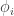 are autoregressive polynomial and 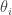 is moving average polynomial. Recall from [Why Moving Averages](https://quantivity.wordpress.com/2010/01/08/why-moving-averages/) that any *stationary* stochastic process can be represented by an 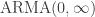, due to [Wold decomposition](http://en.wikipedia.org/wiki/Wold%27s_theorem). Worth recalling is any model whose absolute parameter values are less than 1 is weakly stationary.

Conditional volatility can be described by the GARCH(*m*, *s*) model:

   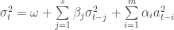
   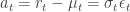

From this formulation, GARCH is nicely illustrated as ARMA applied to the squared series 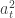. The 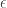 is sequence of iid variables, drawn from one of the following distributions: student-t, skew-t, or skew normal. Choice of student-t and skew are motivated by previous posts (and voluminous literature), which illustrate residuals following such distributions. Readers may wish to note relationship between this squared series and previous autocopula post.

Finally, the [Bayesian Information Criteria (BIC)](http://en.wikipedia.org/wiki/Bayesian_information_criterion) provides the statistic for ranking comparative model fitness of two more ARMA+GARCH models:

   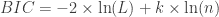

where 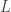 is model-maximized likelihood value,  is number of observations, and  is number of free parameters. Thus, the best model is that with the highest log likelihood penalized by number of estimated parameters (*i.e.* 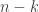).

**Proxy Models**

The following performs model selection for CRM and QQQ, over the 5-year observation period:

```

crmModel <- selectProxyModel(ROC(p[,1], type="discrete", na.pad=FALSE))
qqqModel <- selectProxyModel(ROC(p[,2], type="discrete", na.pad=FALSE))

```

CRM is fitted as *GARCH(1,1) with student-t errors*:

```

       Estimate  Std. Error  t value Pr(>|t|)    
omega  1.219e-05   5.781e-06    2.108    0.035 *  
alpha1 3.552e-02   9.004e-03    3.945 8.00e-05 ***
beta1  9.544e-01   1.115e-02   85.600  < 2e-16 ***
shape  4.247e+00   5.227e-01    8.124 4.44e-16 ***

```

Thus, autoregressive coefficient is order-1, significant, and equal to 0.0355; variance coefficient is order-1, significant, and equal to 0.9544\. Sum of coefficients is 0.9899, thus model possesses either IGARCH unit root or long-memory (*e.g.* [Andersen (1999)](http://papers.ssrn.com/sol3/papers.cfm?abstract_id=1298332)). The residuals are student-t with 4.25 df, which is broadly consistent with the previous distribution fit undertaken in [Empirical Copulas and Hedge Basis Risk](https://quantivity.wordpress.com/2011/10/10/empirical-copulas-and-proxy-cross-hedge-basis-risk).

QQQ is fitted as *GARCH(1,1) with skew-t errors*:

```

        Estimate  Std. Error  t value Pr(>|t|)    
omega  2.833e-06   1.238e-06    2.288   0.0222 *  
alpha1 1.005e-01   1.840e-02    5.464 4.64e-08 ***
beta1  8.956e-01   1.748e-02   51.228  < 2e-16 ***
skew   8.516e-01   2.971e-02   28.669  < 2e-16 ***
shape  6.620e+00   1.410e+00    4.694 2.68e-06 ***

```

Thus, autoregressive coefficient is order-1, significant, and equal to 0.1; variance coefficient is order-1, significant, and equal to 0.8956\. The residuals are skew-t with df = 6.62 and skew = 0.852 (recall student-t is limit of skew-t with skew=0; see [McNeil, Frey, and Embrechts [2005]](http://books.google.com/books?id=vgy98mM9zQUC)). Note autoregression coefficient is nearly 3x larger for QQQ than CRM. Sum of coefficients is 0.9956, thus also possesses either IGARCH unit root or long-memory.

The preceding models can be visualized in several ways. To begin, visualize the conditional volatility for both instruments:

[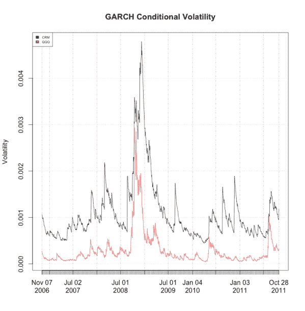](https://quantivity.wordpress.com/wp-content/uploads/2011/10/proxy-garch-vol.png)

Volatility broadly matches intuition and plots from previous posts, with significant spikes during the financial crisis. As observed in previous posts, CRM volatility is significantly larger than QQQ. Note CRM has numerous significant volatility spikes not experienced by QQQ in 2009 and 2010, which correspond to earnings announcements (late-August and mid-November). Kendall correlation of conditional volatility between CRM and QQQ is 0.529, thus there exists a modest volatility dependence relationship:

```

cor(crmModel[3][[1]]@h.t, qqqModel[3][[1]]@h.t, method="kendall")

```

The copula of the GARCH volatility dependence exhibits large probability of absolute changes conditional on previous large changes, consistent with [Lag Dynamics with Autocopulas](https://quantivity.wordpress.com/2011/10/16/lag-dynamics-with-autocopulas):

[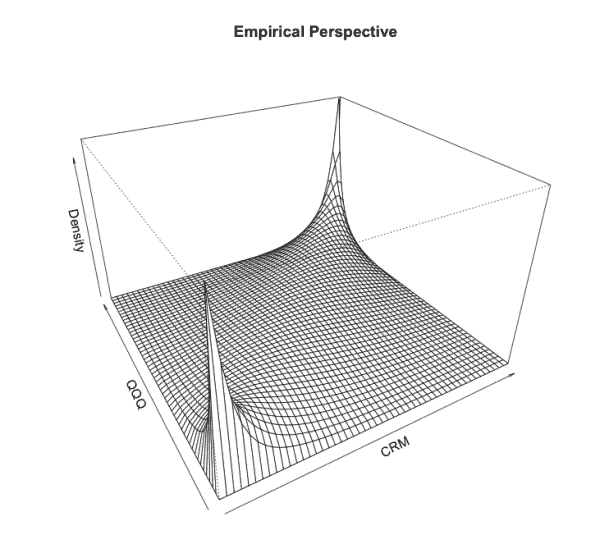](https://quantivity.wordpress.com/wp-content/uploads/2011/10/proxy-garch-vol-copula.png)

Next, GARCH residuals exhibit some shortcoming in model fitness, given they retain modest heteroskedasticity:

[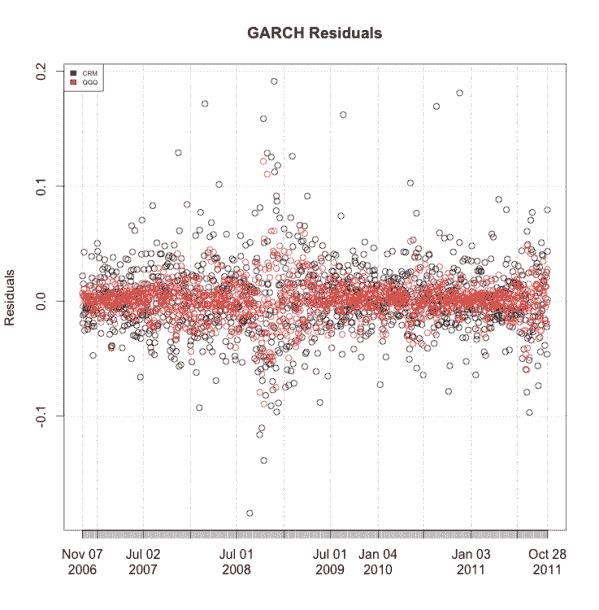](https://quantivity.wordpress.com/wp-content/uploads/2011/10/proxy-garch-residuals.png)

Finally, consider plot of fitted GARCH residual distributions:

[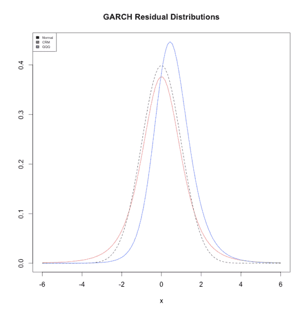](https://quantivity.wordpress.com/wp-content/uploads/2011/10/proxy-garch-error-dist.png)

Which illustrates the significant difference in distribution, both versus each other and normality. Large positive skew for QQQ is particularly interesting. This plot is generated by, where `p` is the price matrix:

```

pROC <- ROC(p, type="discrete", na.pad=FALSE)
x <- seq(-6, 6, length=100)
cnames <- colnames(pROC)
x1 <- dnorm(x)
x2 <- dt(x,df=4.25)
x3 <- dst(x,df=6.62,shape=0.852)
plot(x, x1, type='l',lty=2, ylim=c(0,max(x1,x2,x3)), ylab="", main="GARCH Residual Distributions")
lines(x, x2, col=colors[2])
lines(x, x3, col=colors[3])
legend("topleft",legend=c("Normal",cnames[1],cnames[2]), fill=colors, cex=0.5)

```

* * *

R code for proxy hedging model selection:

```

library("fGarch")

selectProxyModel <- function(p, useMean=FALSE)
{
  # ARMA+GARCH model selection based on BIC, using the following error
  # distributions: student-t, skew-t, and skew normal. ARMA
  # may be either (1,1) or (2,2); GARCH is only (1,1).
  #
  # Args:
  #   p: single vector of instrument price data
  #   useMean: flag indicating whether mean should be fitted in GARCH
  #
  # Returns: selected GARCH model

  g11Std <- garchFit(~ garch(1,1), data = coredata(p), trace = FALSE, cond.dist="std", include.mean=useMean)
  g11SStd <- garchFit(~ garch(1,1), data = coredata(p), trace = FALSE, cond.dist="sstd", include.mean=useMean)
  g11SNorm <- garchFit(~ garch(1,1), data = coredata(p), trace = FALSE, cond.dist="snorm", include.mean=useMean)

  g11A11Std <- garchFit(~ arma(1,1) + garch(1,1), data = coredata(p), trace = FALSE, cond.dist="std", include.mean=useMean)
  g11A11SStd <- garchFit(~ arma(1,1) + garch(1,1), data = coredata(p), trace = FALSE, cond.dist="sstd", include.mean=useMean)
  g11A11SNorm <- garchFit(~ arma(1,1) + garch(1,1), data = coredata(p), trace = FALSE, cond.dist="snorm", include.mean=useMean)

  g11A22Std <- garchFit(~ arma(2,2) + garch(1,1), data = coredata(p), trace = FALSE, cond.dist="std", include.mean=useMean)
  g11A22SStd <- garchFit(~ arma(2,2) + garch(1,1), data = coredata(p), trace = FALSE, cond.dist="sstd", include.mean=useMean)
  g11A22SNorm <- garchFit(~ arma(2,2) + garch(1,1), data = coredata(p), trace = FALSE, cond.dist="snorm", include.mean=useMean)

  gModel <- list(g11Std, g11SStd, g11SNorm, g11A11Std, g11A11SStd, g11A11SNorm, g11A22Std, g11A22SStd, g11A22SNorm)
  gBIC <- data.frame(g11Std@fit$ics[2], g11SStd@fit$ics[2], g11SNorm@fit$ics[2], g11A11Std@fit$ics[2], g11A11SStd@fit$ics[2], g11A11SNorm@fit$ics[2], g11A22Std@fit$ics[2], g11A22SStd@fit$ics[2], g11A22SNorm@fit$ics[2])
  colnames(gBIC) <- c("g11Std-BIC", "g11SStd-BIC", "g11SNorm-BIC", "g11A11Std-BIC", "g11A11SStd-BIC", "g11A11SNorm-BIC", "g11A22Std-BIC", "g11A22SStd-BIC", "g11A22SNorm-BIC")

  minBIC <- order(gBIC,decreasing=FALSE)[1]

  return (list(gBIC, colnames(gBIC)[minBIC], gModel[[minBIC]]))
}

visualizeGarchModels <- function (p, m1, m2, cnames)
{
  # Visualize two garch models in overlapping plots
  #
  # Args:
  #   p: matrix of instrument price data, including valid colnames
  #   m1: first GARCH model to visualize
  #   m2: second GARCH model to visualize
  #   cnames: list of column names
  #
  # Returns: none

  t <- index(p)[2:nrow(p)]

  plot(xts(m1[3][[1]]@h.t, order.by=t), main="GARCH Conditional Volatility", type='l', ylab="Volatility", ylim=c(min(crmModel[3][[1]]@h.t, qqqModel[3][[1]]@h.t),max(crmModel[3][[1]]@h.t, qqqModel[3][[1]]@h.t)))
  lines(xts(m2[3][[1]]@h.t, order.by=t), col=colors[2])
  legend("topleft",legend=c(cnames[1],cnames[2]), fill=colors, cex=0.5)

  plot(xts(m1[3][[1]]@residuals, order.by=t), main="GARCH Residuals", type='p', ylab="Residuals")
  points(xts(m2[3][[1]]@residuals, order.by=t), col=colors[2])
  legend("topleft",legend=c(cnames[1],cnames[2]), fill=colors, cex=0.5)
}

```