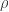

<!--yml
category: 未分类
date: 2024-05-18 13:47:29
-->

# Proxy Hedging and Dependence | Quantivity

> 来源：[https://quantivity.wordpress.com/2011/10/26/proxy-cross-hedge-correlation-dependence/#0001-01-01](https://quantivity.wordpress.com/2011/10/26/proxy-cross-hedge-correlation-dependence/#0001-01-01)

When asked to summarize their approach to [proxy / cross hedging](https://quantivity.wordpress.com/2011/10/02/proxy-cross-hedging), senior folks from numerous big banks reduced it to correlation: hedge using an instrument whose correlation is close to -1\. This perspective matches the popular practitioner literature, such as recently published text [Hedging Market Exposures](http://books.google.com/books?id=CpSv76NCmJcC) (Bychuk and Haughey, 2011). Moreover, this perspective is at the heart of much of the research literature, going back to original definition of optimal hedge ratio  (*e.g.* [Hull](http://books.google.com/books?id=sEmQZoHoJCcC), p. 57):

   

Yet, while indeed true, this wisdom is not terribly helpful in practice for hedging well-known equities, as described in previous posts—as no instrument exists with such high correlation. This motivated revisiting the role of dependence in hedging, uncovering what may perhaps be an interesting result: *multi-period asymptotically perfect hedges exist with *.

To derive this result, begin by asking a simple-sounding question: over what range of correlation between underlying and hedge can a perfect hedge conceivably be built? When evaluated for a *single period*, the answer is obviously a single value: , as  for any other correlation, given:

   .

Yet, this question becomes more interesting when generalized to *multiple periods*. Specifically, consider the temporal series of proxy errors over multiple contiguous periods:

    

Can intuition be built by modeling the temporal evolution of  directly, rather than describing the characteristics of  and ? Consider modeling  using elementary trigonometry, say a familiar sin curve:

[](https://quantivity.wordpress.com/wp-content/uploads/2011/10/proxy-correlation-sin1.png)

This model is interesting, as it captures the two desirable properties for optimal proxy hedging:

*   **Zero crossings**: error crosses zero a positive number of times during its path (determined by `zerocross` parameter below), providing frequent opportunity to exit hedge with zero loss (*i.e.* )
*   **Absolute bounds**: error is bounded, above and below, to not exceed some maximum threshold

These two properties should be familiar to readers who trade relative value strategies.

Given the above evolution of  over time, next question is asking what range of  is possible given arbitrary paths of  and . As always, a picture is worth a thousand words.

Define  to follow a stochastic process of length , whose value is drawn from Gaussian (given  and  parameters):

```

u <- rnorm(n, mu, sd);

```

In other words, the underlying follows a random process, which seems reasonable. Given that,  is determined as the arithmetic difference, given discrete differential of  and desired number of zero crosses for sin curve:

```

e <- (sin(seq(-zerocross*pi, zerocross*pi, len = n)) + 0.01) / 10
de <- diff(e)
h <- de - u

```

The following plots illustrates one sample path of , with corresponding , over the multiple periods (parameters `n=200; zerocross=1; mu=0; sd=0.05`):

[](https://quantivity.wordpress.com/wp-content/uploads/2011/10/proxy-correlation-1-returns.png)

These returns look fairly normal, albeit obviously sampled from a distribution which has neither long tails nor memory.

Given underlying and hedge, the correlation density can be generated by sampling :

```

cor(h, u, method="kendall")

```

The following plots illustrate the simulated scatter and empirical density for , given 1000 iterations (parameters `n=200; zerocross=1; mu=0; sd=0.05`):

[](https://quantivity.wordpress.com/wp-content/uploads/2011/10/proxy-correlation-1-mc.png)

With a single zero cross, this model recovers the classic one-period optimal hedge result: .

Where this model becomes interesting is when number of zero crosses is increased above 1\. Doing so diverges the model from classical single period, conceptually extending time over multiple periods. The following plots illustrate returns when zero cross is 10:

[](https://quantivity.wordpress.com/wp-content/uploads/2011/10/proxy-correlation-10-returns.png)

Visual inspection of the cumulative returns plot makes clear something different is afoot. Clearly the underlying and hedge are not behaving as perfect inverses, when there are more zero crosses. There is something deeper at work. To illustrate further, consider the corresponding sampled correlation plots:

[](https://quantivity.wordpress.com/wp-content/uploads/2011/10/proxy-correlation-10-mc.png)

Illustrating correlation diverging from -1, peaking near -0.73\. Recall this is correlation of underlying and hedge, which is providing *asymptotic optimality* at a finite number of points in time. Is this an accident, or does it represent a more general principle at work? Consider the following return plots for proxy error with 50 zero crosses:

[](https://quantivity.wordpress.com/wp-content/uploads/2011/10/proxy-correlation-50-returns.png)

Now the underlying and hedge look nothing like each other, except their broad directions are consistently inverted. Again, consider the corresponding correlation plots, which illustrate sampled correlation decreasing to density peak near -0.30.

[](https://quantivity.wordpress.com/wp-content/uploads/2011/10/proxy-correlation-50-mc.png)

This illustrates perhaps an interesting result demonstrating counterexample to the conventional wisdom of perfect negative correlation for proxy hedging, albeit only in theory.

* * *

R code to generate the above sampling and plots:

```

proxyMultiPeriodCorrelation <- function(i=100, zerocross=20, n=200, mu=0, 
                                        sd=0.05, doPlot=FALSE)
{
  # Monte carlo sampling for visualizing multi-period correlation dynamics.
  #
  # Args:
  #     i: number of sampling iterations
  #     zerocross: number of zero crosses for error
  #     n: number of iterations for error sin curve
  #     mu: mean of Gaussian samples for u
  #     sd: standard deviation of Gaussian samples for u
  #     doPlot: flag to indicate whether to plot returns
  #
  # Returns: vector of sampled correlations

  e <- (sin(seq(-zerocross*pi, zerocross*pi, len = n)) + 0.01) / 10
  de <- diff(e)

  cors <- sapply(c(1:i), function(i){ 
    u <- rnorm(length(de),mu,sd); 
    h <- de - u;
    pair <- u + h
    c <- cor(h, u, method="kendall");

    if (doPlot)
    {
      oldpar <- par(mfrow=c(2,1))
      plot(u, type='l', xlab="Time", ylab="Returns", main="Optimal Proxy Returns");
      lines(h, col=colors[2])
      legend("topleft",legend=c("Underlying", "Hedge"), fill=colors, cex=0.5)

      cumH <- cumprod(1+h)-1
      cumU <- cumprod(1+u)-1

      plot(cumU,ylim=c(min(cumH,cumU,e),max(cumH,cumU,e)), type='l', ylab="Cumulative Return", xlab="Time", main="Optimal Proxy Cumulative Returns")
      lines(cumH, col=colors[2])
      lines(e, col=colors[3]);
      legend("topleft",legend=c("Underlying", "Hedge", "Error"), fill=colors, cex=0.5)
      par(oldpar)
    }

    return (c)
  })

  oldpar <- par(mfrow=c(2,1))
  plot(cors, ylab="Correlation", main="Optimal Proxy Hedge Correlation Scatter")
  plot(density(cors), xlab="Correlation", main="Optimal Proxy Hedge Correlation Density")
  par(oldpar)

  return (cors)
}

```