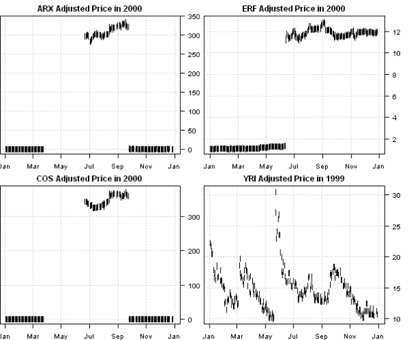
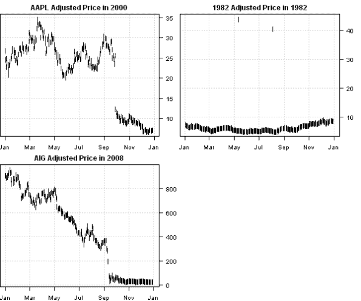

<!--yml
category: 未分类
date: 2024-05-18 14:30:18
-->

# Quality of Historical Stock Prices from Yahoo Finance | Systematic Investor

> 来源：[https://systematicinvestor.wordpress.com/2014/04/08/quality-of-historical-stock-prices-from-yahoo-finance/#0001-01-01](https://systematicinvestor.wordpress.com/2014/04/08/quality-of-historical-stock-prices-from-yahoo-finance/#0001-01-01)

I recently looked at the strategy that invests in the components of [S&P/TSX 60](http://ca.spindices.com/indices/equity/sp-tsx-60-index) index, and discovered that there are some abnormal jumps/drops in historical data that I could not explain. To help me spot these points and remove them, I created a helper function [data.clean() function in data.r at github](https://github.com/systematicinvestor/SIT/blob/master/R/data.r). Following is an example of how you can use [data.clean() function](https://github.com/systematicinvestor/SIT/blob/master/R/data.r):

```

##############################################################################
# Load Systematic Investor Toolbox (SIT)
# https://systematicinvestor.wordpress.com/systematic-investor-toolbox/
###############################################################################
setInternet2(TRUE)
con = gzcon(url('http://www.systematicportfolio.com/sit.gz', 'rb'))
    source(con)
close(con)

	###############################################################################
	# S&P/TSX 60 Index as of Mar 31 2014
	# http://ca.spindices.com/indices/equity/sp-tsx-60-index
	###############################################################################	
	load.packages('quantmod')

	tickers = spl('AEM,AGU,ARX,BMO,BNS,ABX,BCE,BB,BBD.B,BAM.A,CCO,CM,CNR,CNQ,COS,CP,CTC.A,CCT,CVE,GIB.A,CPG,ELD,ENB,ECA,ERF,FM,FTS,WN,GIL,G,HSE,IMO,K,L,MG,MFC,MRU,NA,PWT,POT,POW,RCI.B,RY,SAP,SJR.B,SC,SLW,SNC,SLF,SU,TLM,TCK.B,T,TRI,THI,TD,TA,TRP,VRX,YRI')
		tickers = gsub('\\.', '-', tickers)
	tickers.suffix = '.TO'

	data <- new.env()
	for(ticker in tickers)
		data[[ticker]] = getSymbols(paste0(ticker, tickers.suffix), src = 'yahoo', from = '1980-01-01', auto.assign = F)

	###############################################################################
	# Plot Abnormal Series
	###############################################################################
	layout(matrix(1:4,2))	
	plota(data$ARX$Adjusted['2000'], type='p', pch='|', main='ARX Adjusted Price in 2000')	
	plota(data$COS$Adjusted['2000'], type='p', pch='|', main='COS Adjusted Price in 2000')	
	plota(data$ERF$Adjusted['2000'], type='p', pch='|', main='ERF Adjusted Price in 2000')	
	plota(data$YRI$Adjusted['1999'], type='p', pch='|', main='YRI Adjusted Price in 1999')	

	###############################################################################
	# Clean data
	###############################################################################
	data.clean(data, min.ratio = 2)	

```

[](https://systematicinvestor.wordpress.com/wp-content/uploads/2014/04/plot1.png)

```

> data.clean(data, min.ratio = 2)	
Removing BNS TRP have less than 756 observations
Abnormal price found for ARX 23-Jun-2000 Ratio : 124.7
Abnormal price found for ARX 26-Sep-2000 Inverse Ratio : 99.4
Abnormal price found for COS 23-Jun-2000 Ratio : 124.1
Abnormal price found for COS 26-Sep-2000 Inverse Ratio : 101.1
Abnormal price found for ERF 14-Jun-2000 Ratio : 7.9
Abnormal price found for YRI 18-Feb-1998 Ratio : 2.1
Abnormal price found for YRI 25-May-1999 Ratio : 3

```

It is surprising that [Bank of Nova Scotia (BNS.TO)](http://ca.finance.yahoo.com/q/hp?s=BNS.TO) has only one year worth of historical data. I also did not find an explanations for jumps in the ARX, COS, ERF during 2000.

Next, I did same analysis for the stocks in the [S&P 100](http://ca.spindices.com/indices/equity/sp-100) index:

```

	###############################################################################
	# S&P 100 as of Mar 31 2014
	# http://ca.spindices.com/indices/equity/sp-100
	###############################################################################	
	tickers = spl('MMM,ABT,ABBV,ACN,ALL,MO,AMZN,AXP,AIG,AMGN,APC,APA,AAPL,T,BAC,BAX,BRK.B,BIIB,BA,BMY,COF,CAT,CVX,CSCO,C,KO,CL,CMCSA,COP,COST,CVS,DVN,DOW,DD,EBAY,EMC,EMR,EXC,XOM,FB,FDX,F,FCX,GD,GE,GM,GILD,GS,GOOG,HAL,HPQ,HD,HON,INTC,IBM,JNJ,JPM,LLY,LMT,LOW,MA,MCD,MDT,MRK,MET,MSFT,MDLZ,MON,MS,NOV,NKE,NSC,OXY,ORCL,PEP,PFE,PM,PG,QCOM,RTN,SLB,SPG,SO,SBUX,TGT,TXN,BK,TWX,FOXA,UNP,UPS,UTX,UNH,USB,VZ,V,WMT,WAG,DIS,WFC')
	tickers.suffix = ''

	data <- new.env()
	for(ticker in tickers)
		data[[ticker]] = getSymbols(paste0(ticker, tickers.suffix), src = 'yahoo', from = '1980-01-01', auto.assign = F)

	###############################################################################
	# Plot Abnormal Series
	###############################################################################    
	layout(matrix(1:4,2))	
	plota(data$AAPL$Adjusted['2000'], type='p', pch='|', main='AAPL Adjusted Price in 2000')	
	plota(data$AIG$Adjusted['2008'], type='p', pch='|', main='AIG Adjusted Price in 2008')	
	plota(data$FDX$Adjusted['1982'], type='p', pch='|', main='1982 Adjusted Price in 1982')	

	###############################################################################
	# Clean data
	###############################################################################
	data.clean(data, min.ratio = 2)	

```

[](https://systematicinvestor.wordpress.com/wp-content/uploads/2014/04/plot2.png)

```

> data.clean(data, min.ratio = 2)	
Removing ABBV FB have less than 756 observations
Abnormal price found for AAPL 29-Sep-2000 Inverse Ratio : 2.1
Abnormal price found for AIG 15-Sep-2008 Inverse Ratio : 2.6
Abnormal price found for FDX 13-May-1982 Ratio : 8
Abnormal price found for FDX 06-Aug-1982 Ratio : 7.8
Abnormal price found for FDX 14-May-1982 Inverse Ratio : 8
Abnormal price found for FDX 09-Aug-1982 Inverse Ratio : 8

```

I first thought that September 29th, 2000 drop in AAPL was an data error; however, I found following news item: [Apple bruises tech sector, September 29, 2000: 4:33 p.m. ET](http://cnnfn.cnn.com/2000/09/29/markets/techwrap/) Computer maker’s warning weighs on hardware, chip stocks; Nasdaq tumbles.

So working with data requires a bit of data manipulation and a bit of detective works. Please, always have a look at the data before running any back-tests or making any conclusions.