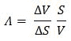

<!--yml
category: 未分类
date: 2024-05-18 08:09:24
-->

# QuantLib, the Greeks and other useful option-related values | Quant Corner

> 来源：[https://quantcorner.wordpress.com/2011/02/06/quantlib-the-greeks-and-other-useful-option-related-values/#0001-01-01](https://quantcorner.wordpress.com/2011/02/06/quantlib-the-greeks-and-other-useful-option-related-values/#0001-01-01)

In this post, we provide the reader with a **C++/QuantLib** code that computes the most common **option sensitivities** – the **Greeks** – as well as the **elasticity** of the option and its **implied volatility**. Before we recall the **Greeks** formulas, as **partial derivatives** of the **Black-Scholes formula**. And, we very briefly indicates how to calculate the **implied volatility**.

One can read here and there that **QuantLib** is overwhelming for the beginner. This post shows once again how powerful **QuantLib**. In fact, once the option parameters and the Quantlib tools coming into play are defined in the code, we get all our Greeks in-a-row. I mean **QuantLib** is definetely worthwhile.

### Delta


### Gamma


### Theta


### Vega


### Elasticity

The elasticity measures the sensitivity of an option in percent to a percent change in the price of its underlying.

[](https://quantcorner.wordpress.com/wp-content/uploads/2011/02/elasticity1.jpg)

### Implied volatility

Obtaining the implied volatility is not straightforward. We must solve the Black-Scholes equation V(S[0], t[0]; σ, r; E, T ) = known value for σ. And, the so-called Newton-Raphson method is commonly used.

### The C++/QuantLib code

To keep the things as simple as possible, we get back to the basic **European option on stocks** we recently programmed. We benchmarked our calculation results with the ones drawing from the **Excel** pricer accompanying **E.G.Haug**‘s handbook ***The complete guide to  option pricing formulas, 2nd Ed.*** .

_________________________________
Option type =                 put
Option strike =               50
Stock Price =                  47
Risk-free rate =              5%
Dividend yield =            0%
Volatility =                      20%
Option expiration =     December  10^(th), 2011
__________________________________

```
#include <ql/quantlib.hpp>

#ifdef BOOST_MSVC
#endif

using std::cout;
using std::endl;
using std::setprecision;
using namespace QuantLib;

#if defined(QL_ENABLE_SESSIONS)
namespace QuantLib
{
	Integer sessionId() { return 0; }
}
#endif

int main(int, char* []) {

	try {
		// Calendar stuff set up
		Calendar calendar = TARGET();
		Date todaysDate(6, February, 2011);
		Settings::instance().evaluationDate() = todaysDate;
		DayCounter dayCounter = Actual365Fixed();

		// Option parameter
		Option::Type type(Option::Put);
		Real underlying = 50;
		Real strike = 47;
		Spread dividendYield = 0.00;
		Rate riskFreeRate = 0.05;
		Volatility volatility = 0.20;
		Date maturity(10, December, 2011);

		// European exercise type handler
		boost::shared_ptr<Exercise> europeanExercise(
			new EuropeanExercise(
			maturity));

		// Quote (=underlying price) handler
		Handle<Quote> underlyingH(
			boost::shared_ptr<Quote>(
			new SimpleQuote(underlying)));

		// Yield term structure handler
		Handle<YieldTermStructure> flatTermStructure(
			boost::shared_ptr<YieldTermStructure>(
			new FlatForward(
			todaysDate,
			riskFreeRate,
			dayCounter)));

		// Dividend handler
		Handle<YieldTermStructure> flatDividendTermStructure(
			boost::shared_ptr<YieldTermStructure>(
			new FlatForward(
			todaysDate,
			dividendYield,
			dayCounter)));

		// Volatility handler
		Handle<BlackVolTermStructure> flatVolTermStructure(
			boost::shared_ptr<BlackVolTermStructure>(
			new BlackConstantVol(
			todaysDate,
			calendar,
			volatility,
			dayCounter)));

		// Payoff handler
		boost::shared_ptr<StrikedTypePayoff> payoff(
			new PlainVanillaPayoff(
			type,
			strike));

		// Black Scholes
		boost::shared_ptr<BlackScholesMertonProcess> bsmProcess(
			new BlackScholesMertonProcess(
			underlyingH,
			flatDividendTermStructure,
			flatTermStructure,
			flatVolTermStructure));

		// Option characteristics
		VanillaOption europeanOption(payoff, europeanExercise);

		// Pricing Engine : in this case BS for European options
		europeanOption.setPricingEngine(boost::shared_ptr<PricingEngine>(
			new AnalyticEuropeanEngine(
			bsmProcess)));

		/**************
		*  OUTPUTTING *
		***************/

		// 1) Option parameters
		cout << "Option type =\t\t" << type << endl;
		cout << "Maturity =\t\t" << maturity << endl;
		cout << "Underlying price =\t" << underlying << endl;
		cout << "Strike =\t\t" << strike << endl;
		cout << "Risk-free int. rate =\t" << setprecision(2) << io::rate(riskFreeRate) << endl;
		cout << "Dividend yield =\t" << io::rate(dividendYield) << endl;
		cout << "Volatility =\t\t" << setprecision(2) << io::volatility(volatility) << endl;
		cout << endl;
		cout << endl;

		// 2) Calculation results
		cout << "Option price :\t" << setprecision(5) << europeanOption.NPV() << endl;
		cout << "Delta :\t\t" << setprecision(5) << europeanOption.delta() << endl;
		cout << "Elasticity :\t" << setprecision(5) << europeanOption.elasticity() << endl;
		cout << "Gamma :\t\t" << setprecision(5) << europeanOption.gamma() << endl;
		cout << "Vega :\t\t" << setprecision(5) << europeanOption.vega()/100 << endl;
		cout << "Theta :\t\t" << setprecision(5) << europeanOption.thetaPerDay() << endl;
		cout << "Rho :\t\t" << setprecision(5) << europeanOption.rho()/100 << endl;
		cout << endl;

		return 0;

		}
		catch (std::exception& e)
		{
			std::cerr << e.what() << endl;
			return 1;
		}
		catch (...)
		{
			std::cerr << "unknown error" << endl;
			return 1;
		}
}
```