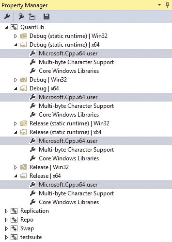

<!--yml
category: 未分类
date: 2024-05-18 08:07:48
-->

# QuantLib installation in Visual Studio Express 2013 | Quant Corner

> 来源：[https://quantcorner.wordpress.com/2015/05/07/quantlib-installation-in-visual-studio-express-2013/#0001-01-01](https://quantcorner.wordpress.com/2015/05/07/quantlib-installation-in-visual-studio-express-2013/#0001-01-01)

Say ***VS2013 Express*** is already installed on your machine (it can be downloaded from [here](https://www.visualstudio.com/en-us/products/visual-studio-express-vs.aspx "Microsoft Visual Studio")). Compiling ***QuantLib*** (‘***QL***‘, thereafter) requires a working ***Boost*** installation. We will then start by Installing the ***Boost*** library.

# **Boost download & installation**

The ***Boost*** project now provides binaries that makes the process installation painless.

(1) Go to [http://sourceforge.net/projects/boost/files/boost-binaries](http://sourceforge.net/projects/boost/files/boost-binaries),

(2) Select the ***Boost*** file corresponding to the release you wish to download and install (we will be using ***Boost 1.57.0***, below).

(3) Choose the installer corresponding to your compiler and platform.

(4) Download the installer on your machine and run it.

In what follows, ***Boost 1.57.0*** has been installed in the folder C:\Boost\boost_1_57_0.

**QuantLib download & installation**

(1) Go to [http://sourceforge.net/projects/quantlib/files](http://sourceforge.net/projects/quantlib/files "sourceforge.quantlib").

(2) Download ***QL*** (the most recent version is ***QL 1.5*** at the time of writing).

***QL*** has been installed in the folder C:\QuantLib-1.5

(3) Start VC++, File > Open File… > C:\QuantLib-1.5\ QuantLib_vc12.sln. You shall then see the Quantlib_vc12 and the 19 projects it contains in ***VS2013***’s *Solution Explorer* window.

(4) Open ***VS2013***’s *Property Manager* window, following View > Other Windows… > Property Manager. There in *Property Manager*, select the *QuantLib* and expand it. It will show the build *modes/platform* nodes.

(5) Select the build mode(s)/platform(s) you wish to build ***QL*** with, eg expand the node *Debug | x64* and select *Microsoft.Cpp.x64.User* inside.

VS2013 ‘s Property Manager window with several solution configurations selected at a time

(6) Then right-click and select *Property* at the bottom in the context menu. A *Property Page* will pop. Click on the *VC++ Directories* tab.

(7) In *Include Directories*, add C:\Boost\boost_1_57_0.

(8) In Libraries Directories, add C:\Boost\boost_1_57_0\libs.

(9) Click on *Apply*, then *OK* to close the *Property Page* window.

(10) Now, select the configuration you wish eg *Release* mode and x64\. Go back to the *Solution Explorer*. Select the **Quantlib_vc12 Solution** in *Solution Explorer*, right-click and *Build*. ***QL*** shall start to build, then.

Note: the official ***QL** *installation documentation can be found [here](http://quantlib.org/install/vc10.shtml "QuantLib Installation documention"). We previously wrote [here](https://quantcorner.wordpress.com/2012/11/13/installing-quantlib-for-vc11-windows/ "Installing Quantlib for VC11") on this topic.