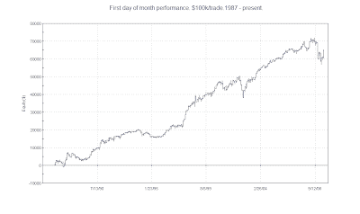

<!--yml
category: 未分类
date: 2024-05-18 13:18:19
-->

# Quantifiable Edges: 1st Day Of Month Tendencies

> 来源：[http://quantifiableedges.blogspot.com/2009/07/1st-day-of-month-tendencies.html#0001-01-01](http://quantifiableedges.blogspot.com/2009/07/1st-day-of-month-tendencies.html#0001-01-01)

The Stock Traders Almanac noted that the Dow Has been up 16 of the last 19 years on the 1st trading day in July. It's been a while since I last looked at 1st day of the month tendencies.

From 1960 until the late 80's there was no decided edge on the 1st trading day of the month. In the late 80's this changed and the 1st day of the month became an outperformer. The most often cited theory as to why is that defined contribution retirement plans like 401k's became more popular. This meant there was a lot of money going into funds right at the beginning of the month, and funds managers were putting it to work.

Below is a performance report showing all the 1st trading days of the month from 1/1/1987 through June, 2009.

The average performance on the 1st day of the month is over 0.2%, which is substantially stronger than the remaining days.

The 1st day of month strength has not been immune to bear markets, though. Below is an equity curve. As you can see, there were sizable dips in the strategy in 2002 and 2008/09.

Lastly I broke out the performance by month. You'll note July has been the most reliable month over the last 22 years. It also ranks 3rd based on average profits. August has had the worst performance.