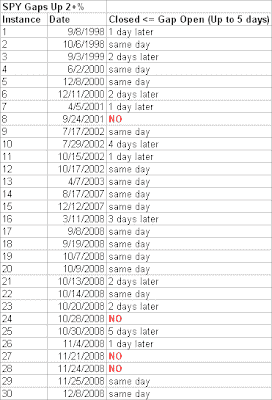

<!--yml
category: 未分类
date: 2024-05-18 13:28:54
-->

# Quantifiable Edges: 2% Gaps Up Revisted

> 来源：[http://quantifiableedges.blogspot.com/2009/01/2-gaps-up-revisted.html#0001-01-01](http://quantifiableedges.blogspot.com/2009/01/2-gaps-up-revisted.html#0001-01-01)

A few months ago I showed a table that looked at every instance of SPY gapping up 2% or more. What I saw was a strong tendency for such large gaps tp pull back and close below their gap level at some point in the next week. There have been 10 instances since and we may get another one this morning. Therefore I've updated the table below:

(click to enlarge)

The pullback doesn't seem quite like the slam dunk it once did, but it still appears probable. Combined with the fact that the market has already traded higher for 3 days in a row, I'd say the chances of seeing a pullback in the next few days is pretty high.