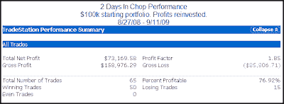
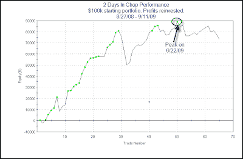

<!--yml
category: 未分类
date: 2024-05-18 13:14:03
-->

# Quantifiable Edges: 2 Days In Chop Systems - 1 Year Later

> 来源：[http://quantifiableedges.blogspot.com/2009/09/2-days-in-chop-systems-1-year-later.html#0001-01-01](http://quantifiableedges.blogspot.com/2009/09/2-days-in-chop-systems-1-year-later.html#0001-01-01)

About a year ago I showed 2 systems that looked to take advantage of the market’s choppy nature. Since that time I have tracked the performance of these two incredibly simple systems in the

[Quantifiable Edges Subscriber Letter](http://www.quantifiableedges.com/gold.html)

. I’ve referred to them as the “2 Days In Chop” systems. As a quick refresher the rules for each are below:

[Long System (2 Days Down In Chop):](http://quantifiableedges.blogspot.com/2008/09/even-in-bad-market-chop-has-provided.html)

1) Buy the SPX any time it closes lower 2 days in a row.

2) Sell the 1st profitable close up to 3 days later.

3) Sell on the 3rd day regardless of profitability.

[Short System (2 Days Up In Chop):](http://quantifiableedges.blogspot.com/2008/08/short-system-for-handling-chop_28.html)

1) Short the SPX any time it closes higher 2 days in a row.

2) Cover the 1st profitable close up to 4 days later.

3) Cover on the 4th day regardless of profitability.

A few quick notes:

At the time the market was locked in a downtrend which is why I gave the shorts an extra day.

I noted the systems were very raw and were not something I would trade “as is”.

Below I will show the combined performance of the 2 systems since I introduced them. In upcoming posts I’ll discuss how I use the systems and also discuss some thoughts on them and some ideas in which the basic systems could be improved.

Here is the performance over the last year +.

A 73% return would seem very impressive for something so simple. It has had a bit of a drawdown lately, though. Below is a profit curve.

The system peaked on 6/22 and has had a few rough trades as of late. Still, the recent drawdown is very small compared to the overall gains of the system.

So why haven’t I simply traded the system “as is” for the last year? I guess you could say that I’m just not smart enough to blindly trade a system this dumb.

I’m getting a little smarter, though. And I’ll have more in upcoming posts.