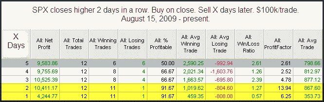

<!--yml
category: 未分类
date: 2024-05-18 13:06:54
-->

# Quantifiable Edges: 2 Up Days In A Market Dominated By Upside Momentum

> 来源：[http://quantifiableedges.blogspot.com/2010/01/2-up-days-in-market-dominated-by-upside.html#0001-01-01](http://quantifiableedges.blogspot.com/2010/01/2-up-days-in-market-dominated-by-upside.html#0001-01-01)

In

[August of 2008 I wrote about a simple system](http://quantifiableedges.blogspot.com/2008/08/short-system-for-handling-chop_28.html)

that looked to take advantage of the choppy market environment by shorting any time SPX closed up 2 days in a row. I tracked the system and used it as an indicator in the subscriber letter from August of 2008 until August of 2009\. In August of 2009 it was becoming apparent that the market had shifted from one dominated by chop to one dominated by upside momentum. In last night’s subscriber letter I ran some studies that showed just how dominant short-term momentum has become. Below is one of those studies:

We see here that since the middle of August, 11 of the 12 times the market has gone up 2 days in a row it has managed to follow through with more gains the next day. It’s also shown a profit 2 days later on 11 of 12 occasions. Shorting 2-day upmoves has been an exceptionally poor strategy in this environment. There are at least a couple of ways traders could use this information. 1) They could look for strategies that try and take advantage of this kind of momentum. 2)They could also simply monitor the action of “2 Up Days” going forward to try and get a feel for when momentum may be waning and the environment changing.

If you’d like to see more on my recent short-term momentum study, you may take a free trial of the Quantifiable Edges Subscriber Letter by

[clicking here](http://www.quantifiableedges.com/members/register.php)

(email address required).