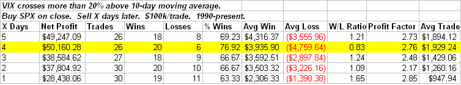

<!--yml
category: 未分类
date: 2024-05-18 13:29:15
-->

# Quantifiable Edges: 20% VIX Stretch Provides Upside Edge

> 来源：[http://quantifiableedges.blogspot.com/2009/01/20-vix-stretch-provides-upside-edge.html#0001-01-01](http://quantifiableedges.blogspot.com/2009/01/20-vix-stretch-provides-upside-edge.html#0001-01-01)

One index that saw a big spike Tuesday was the VIX, which rose almost 23% on the day. It closed more than 20% above its’ 10-day moving average – the first time that has happened since November 20th. Stretches this extreme in the VIX have provided a bullish historical edge over the next few days in the S&P. Below is a study exemplifying this:

Peak stats here are at 4 days. Beyond the 1st week there is no significant edge. 89% of instances saw the market close higher than the trigger price within the next 4 days. The one recent failure was early October 2008\. Prior to that you’d need to go all the way back to 1998 to find another failure.