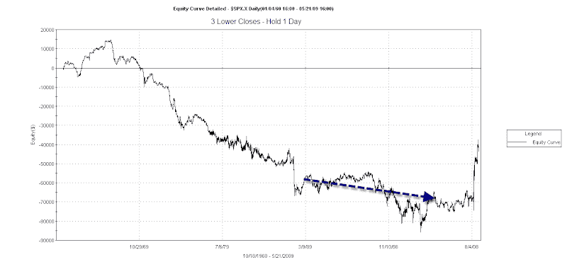

<!--yml
category: 未分类
date: 2024-05-18 13:21:03
-->

# Quantifiable Edges: 3 Lower Closes - A Largely Misunderstood Edge

> 来源：[http://quantifiableedges.blogspot.com/2009/05/3-lower-closes-largely-misunderstood.html#0001-01-01](http://quantifiableedges.blogspot.com/2009/05/3-lower-closes-largely-misunderstood.html#0001-01-01)

The S&P 500 closed lower for the 3rd day in a row yesterday. Three lower closes is often cited as having an upside edge. And it does – kind of. That edge is often misunderstood, though. The first place I saw 3 lower closes quantified was in Larry Connors book “How Markets Really Work”. One of the chapters in the book looked at consecutive days higher and lower. It basically found that after the market has moved in 1 direction for several days, there is a tendency for it to revert.

He measured 3 lower closes in that book from 1989 – 2003\. (All tests were run over that period. It wasn’t specific to this particular setup.) When Larry measured 3 lower closes he looked at any time the market had pulled back for at least 3 days in a row and then showed performance statistics for the following days. What many traders fail to realize when they review his research is that there is a large historical difference between “at least” 3 days in a row and “exactly 3” days in a row. I decided to examine this in some detail tonight.

First let’s look at a chart of buying the S&P 500 any time is has closed lower for at LEAST 3 days in a row and then selling the next day. Keep in mind, if it is down again day 4 it will be bought again. Same with day 5, 6, 7 etc. until there is finally an up day.

There are a few things to note here. First, trying to buy all 3+ day pullbacks prior to 1987 was a losing strategy. After that it the market showed less tendency to trend and an increased tendency reverse. Buying 3+ day drops became profitable. The period covered by the blue arrow shows the period covered in “How Markets Really Work”.

Now let’s look at what happened if you bought the market after 3 and only 3 lower closes. In other words, the third day lower was bought. The position was exited the next day. If the market continued to head south it was ignored. There was no further buying on day 4, 5, or 6.

There is a striking difference between the two graphs. There does appear to be a recent upside edge, but most of it is concentrated on some outlier trades that occurred in the last year. Until very recently there was no advantage to buying the third close lower in a row.

Why the stark differences? I believe much of the reason is due to the strength of the eventual snapback. The more stretched the market gets to the downside, the greater the snapback typically is. The “3 or more” study guarantees a winning trade in every sequence. In other words, it will continue to buy each day until it has a winning day. Only after that will the count reset. The further the market drops, the more vicious the snapback is likely to be.

Below is a table that illustrates this concept covering the time period of 1989 – present. The left hand column is the number of days the market moved lower. The right hand column is the average up day the following day. (Down/losing days are not looked at here.)

As I stated above, the longer the pullback, the stronger the snapback.

Also consider when snapback is most vicious…during bear markets. Note the two time periods on the 2nd equity chart where buying three lower closes has actually provided an edge on the 4th day. Those 2 time periods were during the current and prior bear markets.

So is there really an edge to buying (exactly) three lower closes? Recently during bear market periods – yes. Historically, no. Of course if you understand the mean reversion will likely eventually take place, you can still take advantage of the pullback. You will need some patience, though. Below is a chart of buying day 3 and holding for 3 days (rather than 1).

This chart looks more like the 3 OR MORE chart shown above. In this case it is due to the longer holding period. The longer you hold the more likely you are to participate in the eventual snapback.

The bottom line is that 3 lower closes may indicate the market is getting stretched. The market will likely bounce some time soon. It doesn’t normally offer much of a day 4 edge on its own, though.