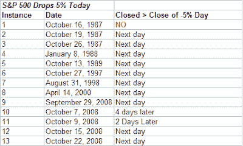

<!--yml
category: 未分类
date: 2024-05-18 13:34:26
-->

# Quantifiable Edges: 5% Drops Often Followed By Rebounds

> 来源：[http://quantifiableedges.blogspot.com/2008/11/5-drops-often-followed-by-rebounds.html#0001-01-01](http://quantifiableedges.blogspot.com/2008/11/5-drops-often-followed-by-rebounds.html#0001-01-01)

I looked back at all prior 5% drops in the S&P 500 since 1960\. From 1960 until 1987 there weren’t any. Since 1987 there have now been 14 of them. The November 5, 2008 drop was the 6th 5% drop since early September. Generally these large drops have been followed by a bounce at some point over the next few days. I show all instances since 1960 in the table below:

Of the 13 instances, 10 closed higher the following day. If you give the trade 4 days to work then 12 of 13 closed higher than the entry at some point. The lone loser was October 16, 1987\. That date is notable because it was the Friday prior to Black Monday.