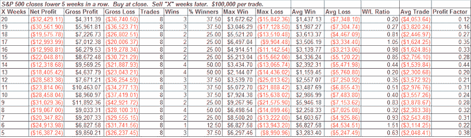

<!--yml
category: 未分类
date: 2024-05-18 08:12:52
-->

# Quantifiable Edges: 5 Weeks Lower - Another Example Of Persistence

> 来源：[http://quantifiableedges.blogspot.com/2008/07/5-weeks-lower-another-example-of.html#0001-01-01](http://quantifiableedges.blogspot.com/2008/07/5-weeks-lower-another-example-of.html#0001-01-01)

[Last week](http://quantifiableedges.blogspot.com/2008/07/selloff-reminiscent-of-60s-and-70s.html)

I showed how the recent downtrend has shown persistence to a degree rarely seen since the 70’s. Below is another example of the downtrend’s persistence from tonight’s

[Weekly Research Letter](http://www.quantifiableedges.com/weekly.html)

.

This test was run from 1960-present. Only 8 occurrences makes it difficult to draw any solid conclusions. Still, these numbers are terrible. The maximum gain 20 weeks later is only 1.7%! The average loss is over 7% and the average trade lost over 4%. There were only three occurrences since 1988, but none of them were positive. They were 8/24/90, 10/13/00 and 3/2/01\. Downside persistence like we’re seeing has historically been bearish.

*For more information on the Quantifiable Edges Weekly Research Letter, [click here](http://www.quantifiableedges.com/weekly.html). For a free sample, simply email* [*weekly@quantifiableedges.com*](mailto:weekly@quantifiableedges.com) *with your name and email address.*