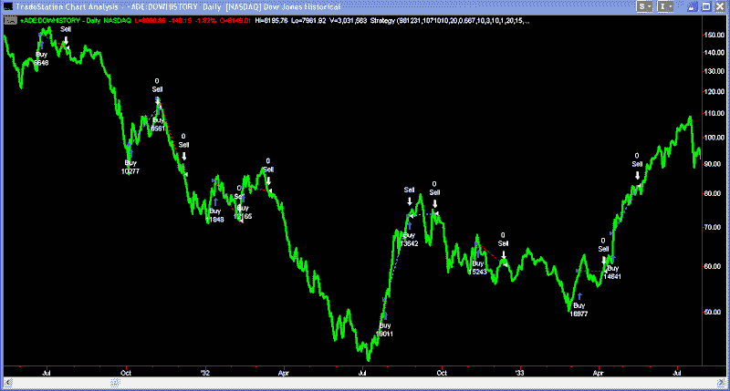

<!--yml
category: 未分类
date: 2024-05-18 13:25:15
-->

# Quantifiable Edges: A 20% Rally In Under 2 Weeks

> 来源：[http://quantifiableedges.blogspot.com/2009/03/20-rally-in-under-2-weeks.html#0001-01-01](http://quantifiableedges.blogspot.com/2009/03/20-rally-in-under-2-weeks.html#0001-01-01)

The current rally has seen the S&P 500 rise over 20% above its recent lows. I looked at other times back to 1960 where the S&P rose 20% or more within a 2-week period. There have only been 3 other instances: November 2008, October 2008 and Following the Crash of 1987.

While the Dow hasn’t managed a 20% gain yet I did use it to look back to 1919\. There was only one other period where there was a cluster of multiple rallies of 20% or more in 10 days or under. That period was 1931-1933\. Below is a chart of the period. I’ve noted every 20% 10-day rise with a buy signal. The sell signal occurs 20 days later so you can more easily see how it performed after the rise.

Short-term results were mixed. As a whole this was a horrible time for both the stock market and the economy.