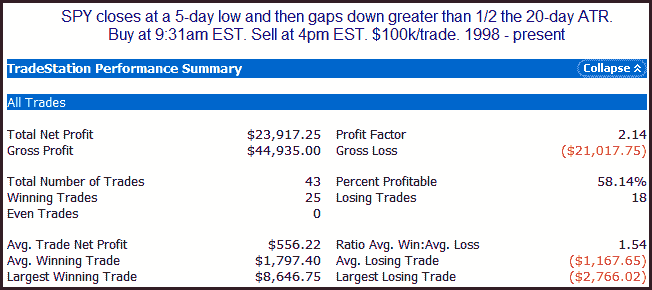

<!--yml
category: 未分类
date: 2024-05-18 12:59:59
-->

# Quantifiable Edges: A Big Gap Down From A 5-day Low

> 来源：[http://quantifiableedges.blogspot.com/2010/05/big-gap-down-from-5-day-low.html#0001-01-01](http://quantifiableedges.blogspot.com/2010/05/big-gap-down-from-5-day-low.html#0001-01-01)

Lots of different ways to look at this morning's gap.

Here's one with results typical of what I'm seeing.

