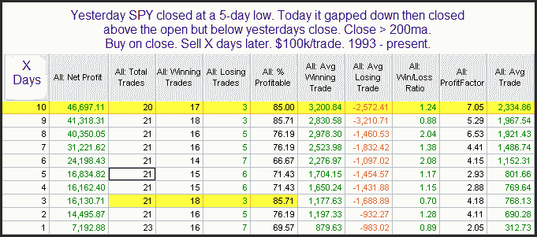

<!--yml
category: 未分类
date: 2024-05-18 13:00:40
-->

# Quantifiable Edges: A Bullish Reversal Pattern In SPY

> 来源：[http://quantifiableedges.blogspot.com/2010/05/bullish-reversal-pattern-in-spy.html#0001-01-01](http://quantifiableedges.blogspot.com/2010/05/bullish-reversal-pattern-in-spy.html#0001-01-01)

What struck me most about Wednesday’s action was the fact that the market closed above it’s open but still down on the day. This little pattern can be bullish under the right circumstances. It will often signal a reversal after there has been a move down.

I showed a few studies related to this in last night’s subscriber letter. Below is one.

This simple pattern suggests a bounce appears likely.