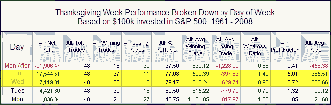

<!--yml
category: 未分类
date: 2024-05-18 13:09:47
-->

# Quantifiable Edges: A Daily Breakdown Of Thanksgiving Week History

> 来源：[http://quantifiableedges.blogspot.com/2009/11/daily-breakdown-of-thanksgiving-week.html#0001-01-01](http://quantifiableedges.blogspot.com/2009/11/daily-breakdown-of-thanksgiving-week.html#0001-01-01)

Seasonal influences are often cited around the Thanksgiving holiday. Therefore I decided I would examine returns during Thanksgiving week as well as the Monday following. Below is how the SPX has performed around Thanksgiving over the last 48 years.

Monday and Tuesday don’t seem to carry a sizable edge. Monday’s total return was actually negative prior to 2008 when it posted a gain of over 6%. Also notable is that the Monday AFTER Thanksgiving’s stats were skewed a bit by the 2008 results. Last year saw a drop of over 8% on that day. Even excluding 2008 there is a bit of a bearish edge apparent on the Monday following Thanksgiving.

Wednesday and Friday surrounding Thanksgiving have been the most consistent and bullish days of the period.