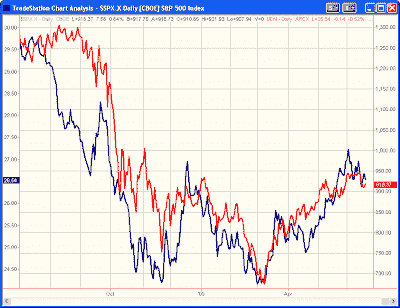
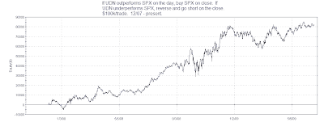

<!--yml
category: 未分类
date: 2024-05-18 13:18:57
-->

# Quantifiable Edges: A Dollar's Edge

> 来源：[http://quantifiableedges.blogspot.com/2009/06/dollars-edge.html#0001-01-01](http://quantifiableedges.blogspot.com/2009/06/dollars-edge.html#0001-01-01)

One relationship I’ve been watching lately is the S&P vs. the US dollar. To illustrate the relationship I’ve created a chart below. In red is the closing prices of the S&P 500\. The blue is closing prices of UDN, which is the US Dollar Bearish Fund ETF.

As you can see they’ve pretty much moved in concert over the last year-plus. Since UDN is a bearish fund this means that the S&P has actually moved opposite the dollar. A weak dollar has been cause for celebration and a strong dollar has closely preceded most of the drops in the S&P.

But can the performance in the dollar provide a trading edge in the S&P? Below is the equity curve of an incredibly simple system. If UDN outperforms SPX on the day, go long SPX at the close. If UDN underperforms, go short SPX at the close. Basically you’re either 100% long or 100% short depending on how the dollar (inverse) performed that day relative to the SPX. For purposes of the test, no commissions or slippage are included.

That’s more than an 82% non-compounded gain over the last 18 months. This edge won’t last forever. Still, this should demonstrate that the correlation between the dollar and the S&P is important. Moves in the dollar have a definite impact on the S&P. S&P traders would be well served to monitor the dollar’s performance closely and on an ongoing basis.