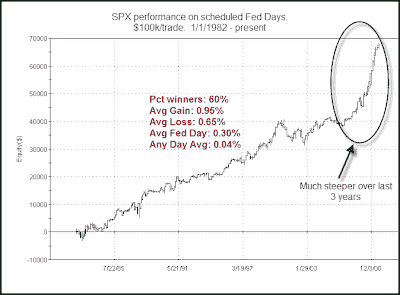

<!--yml
category: 未分类
date: 2024-05-18 13:13:31
-->

# Quantifiable Edges: A Long-Term Look At Fed Days

> 来源：[http://quantifiableedges.blogspot.com/2009/09/long-term-look-at-fed-days.html#0001-01-01](http://quantifiableedges.blogspot.com/2009/09/long-term-look-at-fed-days.html#0001-01-01)

Below is a long term chart of market performance on scheduled Fed days. I didn’t include non-scheduled meetings. Those are generally surprise rate cuts that are aimed at boosting the market. They’re inherently bullish yet unpredictable since the meetings aren’t scheduled. Therefore there is no point in including them in this study.

(click chart to enlarge)

Over the last 27 years there’s been a persistent upside edge. The average Fed day has ourperformed the average day by about 7.5 times.

For more studies on Fed days make sure to check out

[the Fed day link](http://quantifiableedges.blogspot.com/search/label/Fed%20Study)

.