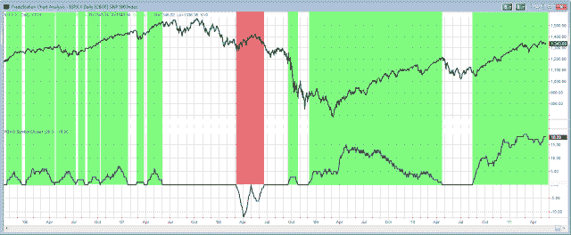

<!--yml
category: 未分类
date: 2024-05-18 08:58:16
-->

# Quantifiable Edges: A Long-Term Look At POMO & the Stock Market

> 来源：[http://quantifiableedges.blogspot.com/2011/05/long-term-look-at-pomo-stock-market.html#0001-01-01](http://quantifiableedges.blogspot.com/2011/05/long-term-look-at-pomo-stock-market.html#0001-01-01)

I’ve discussed my POMO stimulus indicator a number of times on the blog – most recently in the

[March 3, 2010 post](http://quantifiableedges.blogspot.com/2011/03/pomo-stimulus-indicator-update.html)

. Below is a slightly different version of the indicator. Rather than look at volume it simply looks at “days”. Each POMO day in the last 20 that there was buying adds 1 to the indicator. Each day there was POMO selling subtracts 1\. The reason I am showing a day count rather than the typical “volume amount” is that we are looking at a long-term chart. During 2005-2007 there was a good amount of POMO buying. But the levels of buying at that point were much lower than they are now. Therefore if I show “volume” instead of a simple day count, then the activity during that period would be almost imperceptible on the chart.  (Click on chart to enlarge.)

The green shaded areas are times where there was some pumping over the last 20-day period. The pinkish-red shading marks the period where the Fed was selling treasuries instead of buying them. The white areas marked the times where there was no POMO activity over the previous 20 days. POMO buying didn't always seem to take effect immediately, but periods without that buying were generally dismal. The 2 lengthy periods where the POMO indicators were at 0 or below lasted from 6/1/07 through 9/19/08 (SPX lost 18.3%) and from 4/22/10 through 8/17/10 (SPX lost 9.6%).

With QE2 ending soon, this raises the question, is the market capable of rising without the Fed liquidity pump? Or has it become completely dependent on it?