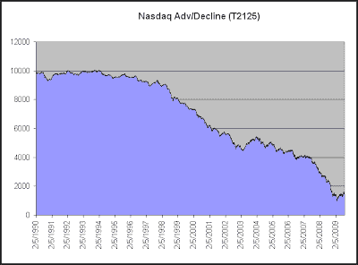

<!--yml
category: 未分类
date: 2024-05-18 13:14:48
-->

# Quantifiable Edges: A Long-Term Look At the Nasdaq Advance/Decline

> 来源：[http://quantifiableedges.blogspot.com/2009/08/long-term-look-at-nasdaq-advancedecline.html#0001-01-01](http://quantifiableedges.blogspot.com/2009/08/long-term-look-at-nasdaq-advancedecline.html#0001-01-01)

[Woodshedder](http://ibankcoin.com/woodshedderblog/)

is starting a new series called “Indicators and edges” in which he will be testing the effectiveness of different indicators. I’m looking forward to reading it. Last night

[he posted some baseline results of the general market](http://ibankcoin.com/woodshedderblog/2009/08/30/indicators-and-edges-baseline-results/)

. In doing so he noted that the percentage of up days on his list of stocks fell much below the % of up days for the major indices. In noticing this he asked if anyone had a possible explanation.

I think a long-term look at the Nasdaq Advance/Decline line could explain a lot of it. I pulled the below data from Worden Bros. TC2000.

Here we see that the Nasdaq Adv/Decl has consistently dropped over the years. While this chart only goes back to 1990, the strong negative bias exists all the way back to the inception of the Nasdaq in 1971\. Even during the Nasdaq bubble days of the late 90’s the Nasdaq Advance/Decline couldn’t muster a rising slope. Worden Bros. was obviously aware of this tendency when they set their beginning value at 10,000 rather than 0.

Over the 1990 – present time period shown above the NYSE Advance/Decline line has seen a slight decline, but it doesn’t have the consistent negative bias of the Nasdaq.

This is mostly due to the fact that the Nasdaq has lower listing standards than the NYSE, so if a company is going to go broke it is more likely to do so on the Nasdaq. An issue which IPOs at $25 and heads to $0 will contribute a lot of declining votes each day along the way, and that is more likely to take place in the Nasdaq.

This was first explained to me by Tom McClellan. If you’re interested in breadth statistics, I’d highly recommend checking out

[some of the work of the McClellans](http://www.mcoscillator.com/)

.

You may also want to check back on Woodshedder’s studies over the next few weeks as well. I’m sure there will be some interesting results.