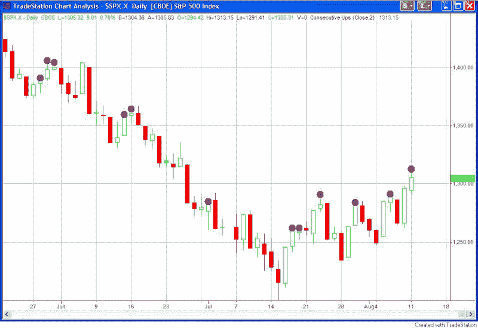

<!--yml
category: 未分类
date: 2024-05-18 13:41:36
-->

# Quantifiable Edges: A Look At Consecutive Up Days Over The Last Couple Of Months

> 来源：[http://quantifiableedges.blogspot.com/2008/08/look-at-consecutive-up-days-over-last.html#0001-01-01](http://quantifiableedges.blogspot.com/2008/08/look-at-consecutive-up-days-over-last.html#0001-01-01)

The market made nice gains for the second day in a row today. Below is a recent chart of the S&P 500\. Every time there were at least 2 up days in a row a purple dot appears.

In most cases over the last 2+ months 2 up days has quickly led to a selloff. The most the S&P gained on any 3rd day of this period was slightly over 2 points. A strong move higher could be a sign of a change in character for the market. Tuesday’s action may be worth noting. It could answer the question as to whether rallies will continue to be sold or whether they can start to accelerate their gains.