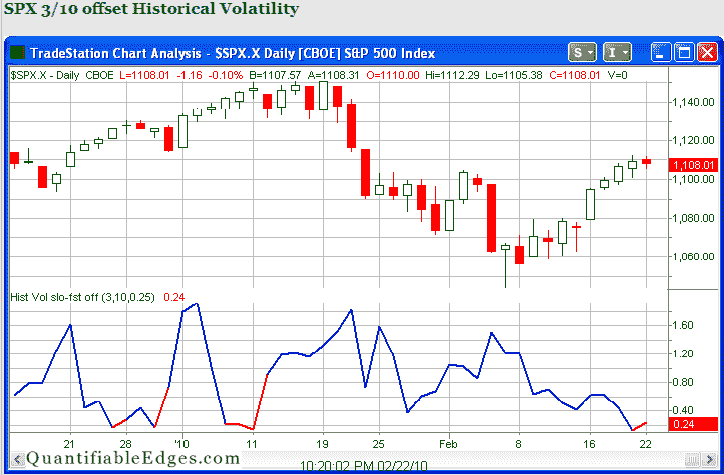

<!--yml
category: 未分类
date: 2024-05-18 13:04:31
-->

# Quantifiable Edges: A Look At The Recent Volatility Contraction

> 来源：[http://quantifiableedges.blogspot.com/2010/02/look-at-recent-volatility-contraction.html#0001-01-01](http://quantifiableedges.blogspot.com/2010/02/look-at-recent-volatility-contraction.html#0001-01-01)

Over the last few days there has been a sharp contraction in volatility.

[In July I discussed an indicator](http://quantifiableedges.blogspot.com/2009/07/what-happens-after-sharp-contraction-in.html)

that looks at the 3-day historical volatility and compares it to the historical volatility of the previous 10 days. When the ratio gets very low (below 0.25 in the study) it suggests a rapid expansion in volatility is likely.

I show this indicator each night on the

[charts page of the members area](http://www.quantifiableedges.com/gold.html)

. I’ve pasted a copy of the chart below.

As you can see we have now spent two days in a row below 0.25\. I’d expect to see a sharp move occur in the next few days.