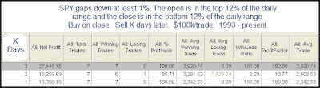

<!--yml
category: 未分类
date: 2024-05-18 13:18:11
-->

# Quantifiable Edges: A Rare Setup That Has Triggered Powerful Bounces

> 来源：[http://quantifiableedges.blogspot.com/2009/07/rare-setup-that-has-triggered-powerful.html#0001-01-01](http://quantifiableedges.blogspot.com/2009/07/rare-setup-that-has-triggered-powerful.html#0001-01-01)

Thursday’s action was extreme in that the gap down was large and the SPY opened at its high and closed at its low. Often reactions this strong and persistent are overreactions. Overwhelming negativity such as this has led to quick, sharp, bounces in the past. Below is a study that exemplifies this:

An average rise of over 2.3% the next day and nearly 4% over the next 3 days is substantial. It can be dangerous to draw concrete conclusions from results that only consist of 7 instances. On the other hand, when results are this overwhelmingly lopsided, it can also be dangerous to ignore them.