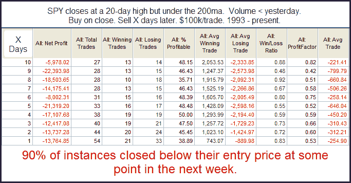

<!--yml
category: 未分类
date: 2024-05-18 12:54:35
-->

# Quantifiable Edges: A SPY Pattern Suggesting A Pullback

> 来源：[http://quantifiableedges.blogspot.com/2010/09/spy-pattern-suggesting-pullback.html#0001-01-01](http://quantifiableedges.blogspot.com/2010/09/spy-pattern-suggesting-pullback.html#0001-01-01)

The

[Quantifinder](http://quantifiableedges.blogspot.com/2009/05/quantifinder-unveiled.html)

yesterday showed a study that has been shared a few times in the

[subscriber letter](http://www.quantifiableedges.com/gold.html)

. It looks at intermediate-term highs being acheived on declining volume in a long-term downtrend.

The 90% consistency rate for some type of pullback is high and implications certainly seem to favor the bearish case.