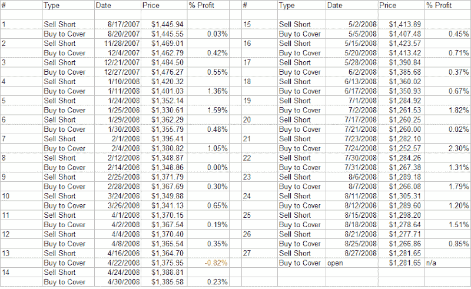

<!--yml
category: 未分类
date: 2024-05-18 13:40:10
-->

# Quantifiable Edges: A Short System For Handling Chop

> 来源：[http://quantifiableedges.blogspot.com/2008/08/short-system-for-handling-chop_28.html#0001-01-01](http://quantifiableedges.blogspot.com/2008/08/short-system-for-handling-chop_28.html#0001-01-01)

In my recent

[Trend vs. Chop](http://quantifiableedges.blogspot.com/search/label/Trend%20Vs.%20Chop)

series I showed how over the last 15 months or so the market has become more prone to chop and less prone to follow-through. Tonight I will show an incredibly simple system that would have fared exceptionally well over this time period. I’ll then discuss the possible value of such a system.

Entry Criteria:

1) The S&P 500 closes higher 2 days in a row AND

2) The S&P closes below its 200-day moving average then sell short on close.

Exit Criteria:

1) If the S&P closes under the entry price of the trade, cover on close OR

2) Cover on the close of day 4 if not profitable.

Time Period: 6/1/2007 – present

Results:

There have been 26 trades, 25 (96%) of which were profitable. The average trade made about 0.75%. They are listed below:

If you relax the entry criteria and don’t require the S&P to close below the 200ma, then there will be 43 trades – 41 (95%) of which were profitable.

Some thoughts:

Although the performance has been stellar over the last 15 months, this is not a great system. In fact, if you run performance back to 1960, it’s not even a winning system.

I’m not a fan of the exit criteria. It keeps winners small. With a little effort I’m sure traders could come up with a more profitable exit strategy – even if it meant suffering a few more losing trades.

The bottom line here is that the market has been especially choppy over the last 15 months. Once aware of this, traders should look to take advantage. Seeing the market move in one direction for even a couple of days should alert traders that they may want to take profits or consider a strategy to benefit from a swing in the opposite direction.

Lastly, this environment will certainly change. While the above system may not be a great “trading” system, it does appear to be a very useful “tracking” system. In other words, moves higher of 2 days or more have quickly reversed and provided the system a nice string of winning trades. Traders should be on alert for system failures, as they could be a sign that selling into up-moves may be falling out of favor and the market environment changing. Therefore they would need to adjust their approach to take advantage of the new, emerging environment.