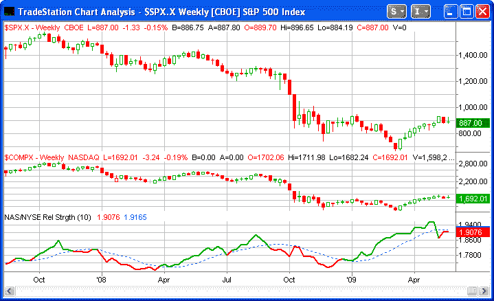
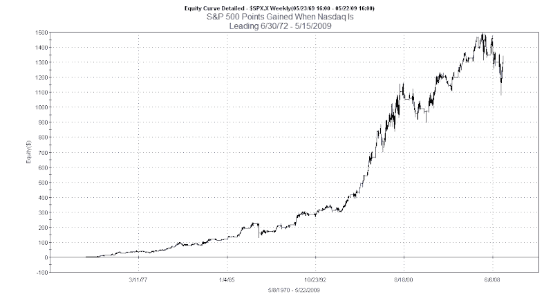
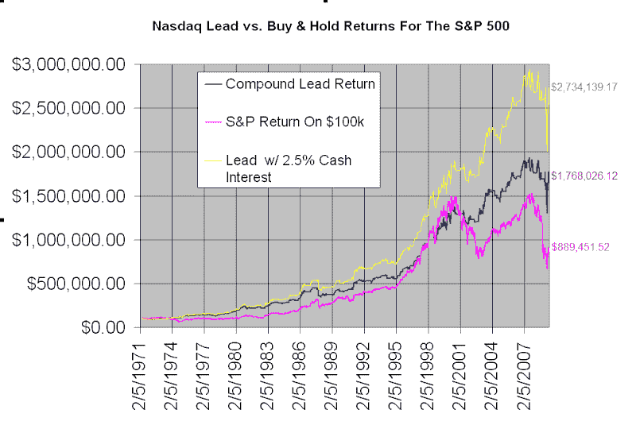

<!--yml
category: 未分类
date: 2024-05-18 13:20:54
-->

# Quantifiable Edges: A Simple & Powerful Timing Indicator

> 来源：[http://quantifiableedges.blogspot.com/2009/05/simple-powerful-timing-indicator.html#0001-01-01](http://quantifiableedges.blogspot.com/2009/05/simple-powerful-timing-indicator.html#0001-01-01)

Today I am going to discuss a slight twist on an intermediate-term indicator that I’ve discussed before. The idea comes from Gerald Appel’s book

[“Technical Analysis – Power Tools For Active Investors”.](http://www.amazon.com/Technical-Analysis-Power-Active-Investors/dp/0131479024/ref=pd_bbs_sr_1?ie=UTF8&s=books&qid=1204128571&sr=8-1)

In it he discusses a relative strength measure of the NYSE vs. the Nasdaq looked at on a weekly chart. The premise behind the indicator is that the market tends to perform better when the appetite for Nasdaq stocks is greater than the appetite for NYSE stocks.Part of this is due to the higher volatility of the Nasdaq, and part of it is due to investors willingness to speculate more aggressively when their outlook is positive. Critics of the indicator suggest the reason it works is largely due to the higher beta of the Nasdaq. That may be part of it, but it doesn’t mean the indicator is without value. In fact, whatever the reasons behind it, the indicator has been an excellent barometer over the years. In the book, Mr. Appel suggests using a 10-week relative strength indicator to measure this phenomenon.

Since I normally trade the S&P 500 and not the NYSE Composite, I applied the indicator to the S&P 500\. Doing so, I found the results to be even better. The indicator is shown in the chart below.

The two lines on the bottom panel are the relative strength indicator. When the solid line closes above the dotted line that means the Nasdaq is leading the S&P. When it closes below the dotted line, that means it is lagging the S&P. To make it even easier to view I’ve made the line green when the Nasdaq is leading and red when the Nasdaq is lagging. As you can see, the Nasdaq is currently lagging.

The performance can be evaluated a number of ways. This first equity graph (courtesy of Tradestation) shows the points gained in the S&P 500 since June 30, 1972 – May 15, 2009.

As you can see, over the time period measured the S&P gained 1,341.27 points when the Nasdaq was leading. Meanwhile, the total points gained by the S&P over the period was 775.74\. The Nasdaq held a leadership position just slightly more than ½ the time during the period. So almost twice the gains (points-wise) were achieved in nearly half the time. Not bad.

What if you started with a $100,000 portfolio and compared buy and hold to only holding when the Nasdaq led?

I decided to show these results in Excel.

These results represent returns from 4/19/1971 – 5/22/2009\. They do not include dividends. The pink line is the growth of $100k in the S&P 500\. The blue line shows the results of investing in the S&P only when the Nasdaq is in a leadership position and earning 0% interest otherwise. The yellow line shows results if instead of earning 0% interest, you managed to earn a steady 2.5% interest on your cash balance while not in the market. While 2.5% isn’t easily doable today, over most of the time period it was extremely low.

It appears the only period where the Nasdaq/S&P Relative Strength Indicator didn’t provide an edge was during the 1995-2000 boom market when you would have wanted to be invested basically the whole time.

The ending value differences are striking. By sitting out of the market when the Nasdaq is lagging and earning a minimal interest rate on your cash, returns more than tripled. Nearly $2,000,000 more would have been earned on an investment of $100,000.

The Nasdaq/S&P relative strength indicator is well worth keeping and eye on and is a useful tool for measuring the health of the market. I’ve recently added it as one of the weekly charts I track on the

[Quantifiable Edges members charts page](http://www.quantifiableedges.com/members/charts.php)

.

I’ve also posted a few files on the

[free downloads section of the website](http://www.quantifiableedges.com/members/freedownload.php)

that may be downloaded.

1) The 1st file is the Excel worksheet that shows exactly how the model was built and the returns calculated. It also includes the chart shown above. Anyone interested in using Excel for historical backtesting or modeling, or who would like to see exactly how the relative strength indicator was calculated, may find it useful.

2) The 2nd file is a zip file for Tradestation users. In the zip file is an eld with the indicator that you may apply to your charts and a strategy that will allow you to run your own tests. Also included in the zip file is a worksheet that has everything all set up. It was created in Tradestation 8.5 (build 2289). My understanding is that if you are using an older version of Tradestation the .eld should import fine, but the worksheet may not open properly. Therefore, after importing the .eld file you’ll need to set up your own chart to apply the indicator and strategy.

Anyone who is a subscriber, or has taken a free trial of

[Quantifiable Edges](http://www.quantifiableedges.com/meminfo.html)

in the past, or has registered prior to downloading the

[Daily Trading Coach Historical Patterns Sample Spreadsheet](http://quantifiableedges.blogspot.com/2009/05/daily-trading-coach-review-historical.html)

is already registered to access the free downloads section. If you don’t recall or don’t have a password, just enter your email address and click on the “Don’t know your password?” line below the login box and it will be immediately emailed to you.

Here’s a link to the free downloads page:

[http://www.quantifiableedges.com/members/freedownload.php](http://www.quantifiableedges.com/members/freedownload.php)