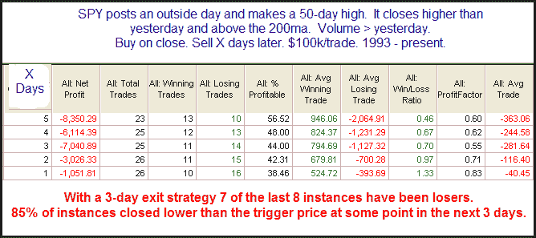

<!--yml
category: 未分类
date: 2024-05-18 13:07:25
-->

# Quantifiable Edges: A Study Based On Thursday's Action

> 来源：[http://quantifiableedges.blogspot.com/2010/01/study-based-on-thursdays-action.html#0001-01-01](http://quantifiableedges.blogspot.com/2010/01/study-based-on-thursdays-action.html#0001-01-01)

Thursday’s price & volume action had a lot of characteristics that would appear bullish. These include the fact that it posted an outside day and closed higher. It also made a new 50-day intraday high. The SPX is in a long-term uptrend and trading above its 200ma. Lastly, the volume rose Thursday as the market rallied. Sometimes it can be interesting to take a number of market observations like these that would seem to obviously suggest a bullish edge and run them through the wayback machine. Below is a study that did just that:

Rather than combining for a bullish edge it appears the scenario above has often been followed by downside.