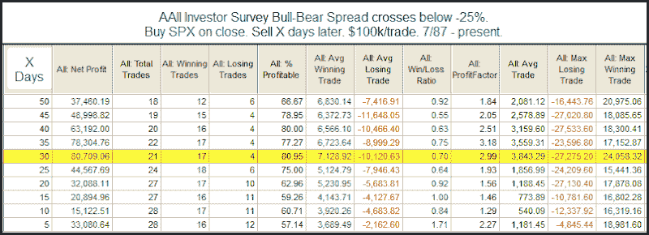

<!--yml
category: 未分类
date: 2024-05-18 12:55:11
-->

# Quantifiable Edges: AAII Investors Survey Reaching Extreme Bearishness

> 来源：[http://quantifiableedges.blogspot.com/2010/08/aaii-investors-survey-reaching-extreme.html#0001-01-01](http://quantifiableedges.blogspot.com/2010/08/aaii-investors-survey-reaching-extreme.html#0001-01-01)

One indicator I thought it was worth taking a closer look at this weekend was the

[AAII Investor Sentiment survey](http://www.aaii.com/sentimentsurvey/)

. In general the survey is viewed by technicians as a contrary indicator when it reaches extremes.

This past week the number of bears rose to 49.5% and the bulls dropped to 20.7% so it is now at fairly extreme levels. The last time the Bull-Bear Spread was this low was in early July as the July rally was just beginning. Prior to that is was the first week of November of ’09 just as that rally was kicking off, and the time before that was early March of ’09 just before that rally began.

I looked at the data a number of different ways this weekend. (For those interested you may get all the data using the AAII link I provided above. Just scroll down and you’ll find a link to a historical spreadsheet on the right hand side of the page.) Below is a sample if the kind of results I saw when conducting some studies.

So what we see here is that an extremely pessimistic outlook from investors has been followed by a rise in the market on pretty consistent basis. Six weeks later the market has been higher 81% of the time and the average gain was over 7%. The problem is that the failures have been very, very large. Using the same 6-week time frame the average loss was 10% and the max loss was 27%. The max loss occurred in September/October of 2008\. August of 1990 also saw a sharp decline in the spread to levels similar to current levels. That was followed by further selling that maxed out around a 12% decline between then and October. Other instances that were followed by large selloffs included July of 2002 with a 12% decline and February 2009 with a 14% decline.

So it appears the AAII Investment Survey is suggesting there is a good chance of a rally emerging over the next several weeks. But if the market can’t manage to rally then the probable alternative is a substantial selloff.