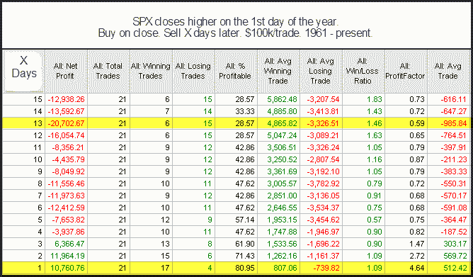

<!--yml
category: 未分类
date: 2024-05-18 13:07:35
-->

# Quantifiable Edges: After An Up Day To Start The Year

> 来源：[http://quantifiableedges.blogspot.com/2010/01/after-up-day-to-start-year.html#0001-01-01](http://quantifiableedges.blogspot.com/2010/01/after-up-day-to-start-year.html#0001-01-01)

One interesting study I showed in last night’s

[Subscriber Letter](http://www.quantifiableedges.com/gold.html)

was to look at market performance following a positive 1st day of the year. Below are the results:

There appears to be a high probability of immediate follow-through. After the first 1-2 days, though, expectations expectations for the next 2-3 weeks turn negative.