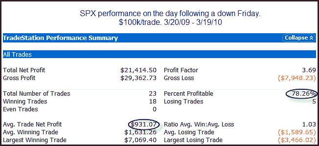
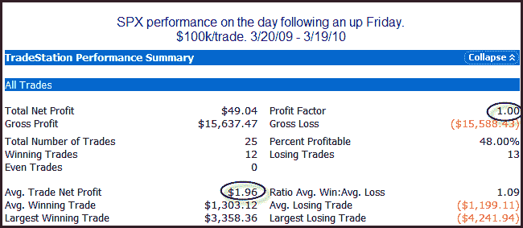

<!--yml
category: 未分类
date: 2024-05-18 13:02:58
-->

# Quantifiable Edges: After Down Fridays Over The Past Year...

> 来源：[http://quantifiableedges.blogspot.com/2010/03/after-down-fridays-over-past-year.html#0001-01-01](http://quantifiableedges.blogspot.com/2010/03/after-down-fridays-over-past-year.html#0001-01-01)

One place there has been an edge over the last year is in buying Fridays that closed down. Below is a study that illustrates this.

These are some fairly incredible results for just looking to buy a down Friday. Even if you eliminate the 7% winner, which was actually the 1st instance from 3/20/09, results are still very strong. The average trade would be 0.7% instead of 0.9%.

I also looked at how the market has performed over the same time period when Friday has closed up.

It appears the edge has only been on down Fridays.

It is important to understand that this is what I often refer to as an “environmental edge”. In other words, it is something that has worked in the recent past and seems to be a result of the current market environment. It is not an edge that has persisted over a long period of time nor do I expect it to continue to persist for a long period of time from now. That doesn’t mean it isn’t a useful observation, though. In such cases where I believe a setup contains an environmental edge I will look to use it to my advantage until it appears to be losing its effectiveness. Of course I do this with all edges, but environmental edges are on a tighter leash than others.