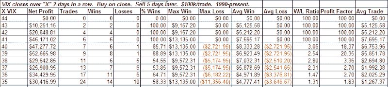

<!--yml
category: 未分类
date: 2024-05-18 13:37:14
-->

# Quantifiable Edges: An Elevated VIX Study

> 来源：[http://quantifiableedges.blogspot.com/2008/10/elevated-vix-study.html#0001-01-01](http://quantifiableedges.blogspot.com/2008/10/elevated-vix-study.html#0001-01-01)

On Friday the VIX closed above 45 for the 2nd day in a row. This is the 1st time since the VIX has been measured back to in 1990 that this has happened. Meanwhile the VXO closed above 50 for the 2nd day in a row. The only other time readings this high can be seen were in a back-adjusted 1987 period during and after the crash. I ran some tests to see how the market has performed the week following back to back readings above other extremely high levels:

While the instances get low over 40, average profits of greater than 5% over the next 5 days across the board are quite impressive.