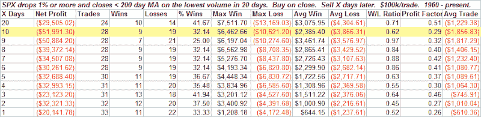

<!--yml
category: 未分类
date: 2024-05-18 13:41:07
-->

# Quantifiable Edges: An Instance Where Light Volume Pullbacks Don't Provide Bullish Expectations

> 来源：[http://quantifiableedges.blogspot.com/2008/08/instance-where-light-volume-pullbacks.html#0001-01-01](http://quantifiableedges.blogspot.com/2008/08/instance-where-light-volume-pullbacks.html#0001-01-01)

Normally light volume on a pullback can be regarded as a good thing. When the pullback is fairly large and the volume is

*extremely* *light*

the expectations can turn bearish. For instance, the S&P dropped about 1.5% today on the lightest volume since July 3rd. I loosened the parameters slightly to get a decent sized sample and ran a study:

Of course volume this week and next week are expected to be a bit lighter due to traders taking vacations. Still, I don’t find the results terribly encouraging for the bullish case over the next two weeks.