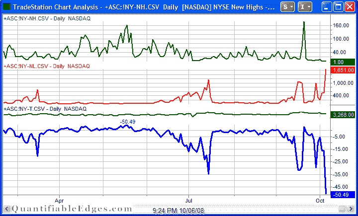

<!--yml
category: 未分类
date: 2024-05-18 13:37:01
-->

# Quantifiable Edges: An Off-The-Charts Example

> 来源：[http://quantifiableedges.blogspot.com/2008/10/off-charts-example.html#0001-01-01](http://quantifiableedges.blogspot.com/2008/10/off-charts-example.html#0001-01-01)

As an example of the kind of extremes I was referring to in my previous post, below is a chart of (NYSE New Highs - NYSE New Lows) / Total Issues. New Highs are in the top panel. News lows are in the 2

nd

panel. Total issues are in the 3rd and the net percentage is in the bottom panel. Over 50% net of issues hit new lows yesterday.

According to my data, the last time the reading was under -50% was 10/19 and 10/20/87\. Prior to that was 5/21, 5/25 and 5/26/1970, which is about as far back as my data goes.

Edit: It was pointed out in the comments section that

[Dr. Steenbarger also noticed this](http://traderfeed.blogspot.com/2008/10/look-at-broad-weakness-in-stock-market.html)

. His data went back prior to 1970 and he found an additional instance.