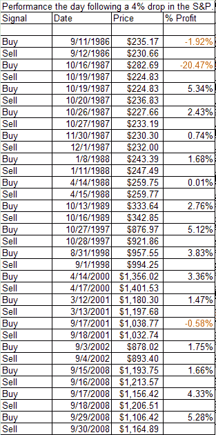

<!--yml
category: 未分类
date: 2024-05-18 13:37:24
-->

# Quantifiable Edges: Another Example Of Unprecedented Volatility

> 来源：[http://quantifiableedges.blogspot.com/2008/10/another-example-of-unprecedented.html#0001-01-01](http://quantifiableedges.blogspot.com/2008/10/another-example-of-unprecedented.html#0001-01-01)

Including Thursday there have been 18 days since 1960 where the S&P 500 has closed down 4% or more. Four of them have come in the last 3 weeks. The only other period to come close was the Crash of ’87 when it occurred on 10/16, 10/19, and 10/26\. Of the previous 17 instances, the market finished higher the next day 14 times. All instances are listed below:

Recent volatility is tremendous, and this is just another example of it.

With such volatility comes opportunity. When looking to take advantage of edges during extreme periods such as this, traders need to make sure they are comfortable executing their plan. Otherwise they could end up as part of the panicked crowd. Trading while in a panicked state simply isn’t conducive to optimal decision making.

One last tip. Bailout news tomorrow could make for fast market conditions. Traders may want to place any stops they are planning ahead of the news. Otherwise execution may become difficult to impossible.