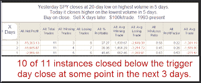

<!--yml
category: 未分类
date: 2024-05-18 13:17:56
-->

# Quantifiable Edges: Another Example of a Weak Bounce

> 来源：[http://quantifiableedges.blogspot.com/2009/07/another-example-of-weak-bounce.html#0001-01-01](http://quantifiableedges.blogspot.com/2009/07/another-example-of-weak-bounce.html#0001-01-01)

My studies indicated a bounce was likely yesterday. It arrived, but unfortunately it was another example of a weak bounce. Below is a study that looks at SPY bounces from lows that lack volume.

(click to enlarge)

The only instance that did NOT post a lower close within 3 days was just 2 weeks ago – on 6/23/09.