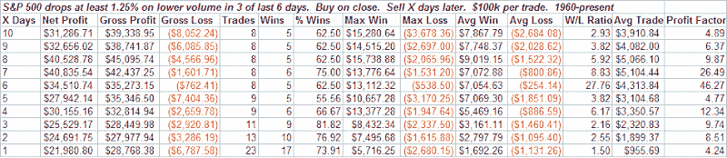
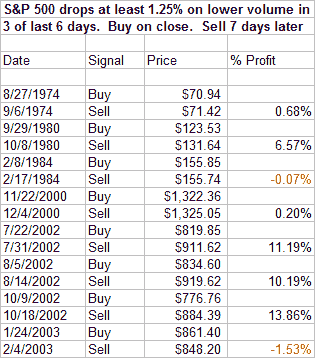

<!--yml
category: 未分类
date: 2024-05-18 08:10:59
-->

# Quantifiable Edges: Another Large, Low Volume Drop - Massive Edge or Statistical Anomaly?

> 来源：[http://quantifiableedges.blogspot.com/2008/08/another-large-low-volume-drop-massive.html#0001-01-01](http://quantifiableedges.blogspot.com/2008/08/another-large-low-volume-drop-massive.html#0001-01-01)

The market has been on a roller coaster ride lately. It’s been six sessions since the initial bounce off the July lows topped out. In the last six days the S&P 500 has closed either up at least 1.25% or down at least 1.25% five times. Three times it’s been to the downside. All three times the big drops came on lower volume. As you might suspect, seeing the S&P drop 1.25% on lower volume 3 times in 6 days is a fairly rare event. Below is a summary of how the market has traded following such events:

The number of instances is too low to make much out of but the size of the returns is certainly eye-popping. An average return of over 5% in the next 7 sessions. That’s a substantial pop to say the least. For those who would like to review the dates, they are all listed below. Notice how 2002 dominated the study.

While not statistically significant, I find the results noteworthy and interesting. So to the header question: Are we looking at a massive edge or a statistical anomaly?

I'll let you decide.