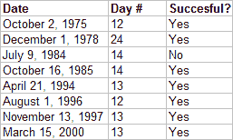

<!--yml
category: 未分类
date: 2024-05-18 08:32:50
-->

# Quantifiable Edges: Are IBD Follow Through Days After Day 10 Less Reliable?

> 来源：[http://quantifiableedges.blogspot.com/2008/02/are-ibd-follow-through-days-after-day.html#0001-01-01](http://quantifiableedges.blogspot.com/2008/02/are-ibd-follow-through-days-after-day.html#0001-01-01)

One of the interesting claims that William O’Neil make about Follow Through Days is that they are less likely to work if they come more than 10 days from the potential market bottom. As part of the study on Follow through Days, I decided to test this. Those who missed the first several installments of this study may want to click on the “IBD Follow Through Day” label lower down on the right hand side of the page. This will be the 9th installment in the series.

Using the

[original basic assumptions](http://quantifiableedges.blogspot.com/2008/01/ibd-follow-through-days-pt-1-are-they.html)

of an 8% decline needed and a 1% up move on the Follow Through Day (as opposed to the current 1.7% requirement that

[I found to be less effective](http://quantifiableedges.blogspot.com/2008/01/follow-through-days-pt-2-does-every.html)

), I reviewed all FTD’s

[listed in the study](http://robertbhanna.googlepages.com/home)

.

A Follow Through Day actually occurring after day 10 was a fairly unusual occurrence. Downtrends and bottom formations typically carry significant volatility, so a strong, high-volume move off a low normally occurs before day 10.

Of the 65 FTD’s listed in the study, only 8 of them occurred on day 10 or later. They are listed below along with the FTD Day # and whether they were “successful” or not. (Success was defined in

[Part 1 - Are They Predictive?)](http://quantifiableedges.blogspot.com/2008/01/ibd-follow-through-days-pt-1-are-they.html)

Seven of the eight FTD’s that came after day 10 were successful according the study. While the sample size may be too small to claim significance, there certainly seems to be no credence to

[the claim that FTD’s after Day 10 are LESS reliable](http://www.actwin.com/kalostrader/FollowThrough.htm)

. In fact, the opposite appears true. Seven out of eight seems especially impressive considering the fact that only 55% of the FTD's in the study were successful. I suspect one reason for this may be that the delayed FTD allows stocks more time to carve out proper basing formations before the market attempts to launch higher. In light of the facts, it seems a curious claim for IBD to make.

The takeaway here is: next time a follow through day doesn’t come immediately, traders shouldn’t fret. The chance of success is likely higher.