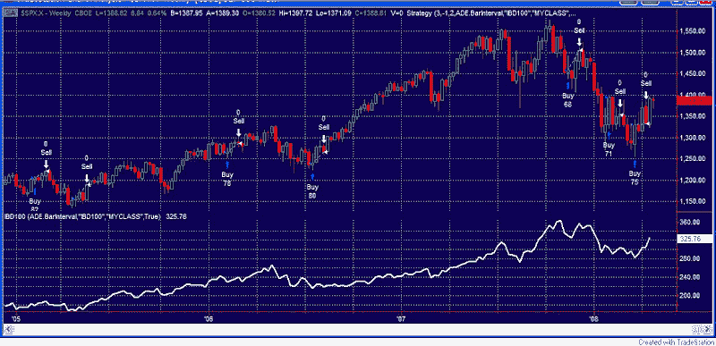

<!--yml
category: 未分类
date: 2024-05-18 08:26:13
-->

# Quantifiable Edges: Are The Leaders Suggesting A Market Meltdown Or A Sector Rotation?

> 来源：[http://quantifiableedges.blogspot.com/2008/04/are-leaders-suggesting-market-meltdown.html#0001-01-01](http://quantifiableedges.blogspot.com/2008/04/are-leaders-suggesting-market-meltdown.html#0001-01-01)

While the major indices faired well on Thursday, the IBD 100 got whacked. Only 28 stocks rose and the Index declined over 2%. (

[Hat tip to IBDIndex](http://ibdindex.blogspot.com/)

.) I noticed this has been an especially bad week for the IBD 100\. While the S&P 500 is only down 2 points the IBD 100 is lower by almost 3.5%.

The IBD 100 is a group of 100 stocks compiled by Investors Business Daily that represent market leadership. Unlike more traditional indexes, it is updated weekly and turnover on the list is quite high. Since it is supposed to represent current market leadership, I was curious to see if the strong underperformance so far this week would be significant if the major indices actually managed to close positive. In other words, in a generally rising market, does a breakdown in leadership signify sector rotation, or is it a sign that the indices will soon follow the leaders south?

I looked back at weekly data to 3/12/2004, which is all I had available for the IBD 100\. There have only been 3 times when the IBD has lost as much as 3% while the S&P has managed to finish the week positive. They were 3/10/06, 7/21/06, and 3/21/08\. Below is a chart of all the instances where the S&P has had a positive week and the IBD 100 has dropped at least 1%.

I’ll let you draw your own conclusions, but I’m having trouble finding anything that would suggest a meltdown is imminent. It appears the next 3-4 weeks have often been positive following these instances.

Note: If anyone has or knows where I could find the daily IBD 100 Index values going back to its inception in 2003, please let me know. Thanks.