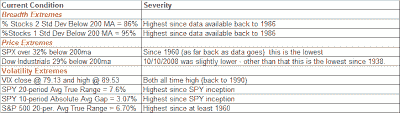

<!--yml
category: 未分类
date: 2024-05-18 13:35:19
-->

# Quantifiable Edges: Back To The Extreme

> 来源：[http://quantifiableedges.blogspot.com/2008/10/back-to-extreme.html#0001-01-01](http://quantifiableedges.blogspot.com/2008/10/back-to-extreme.html#0001-01-01)

A couple of weeks ago

[I showed a table](http://quantifiableedges.blogspot.com/2008/10/extreme-conditions.html)

detailing a number of extremes the market had reached. The sharp bounce on 10/13 relieved many of them. Now some are back – along with a few new ones: (click to enlarge - for some reason I've had trouble making the .png's larger in Blogger the past few days)

