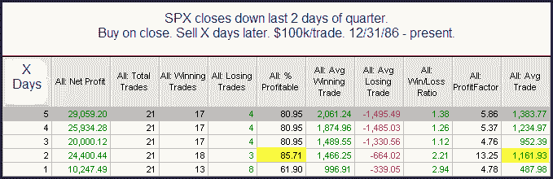

<!--yml
category: 未分类
date: 2024-05-18 13:12:58
-->

# Quantifiable Edges: Bad Ends To The Quarter

> 来源：[http://quantifiableedges.blogspot.com/2009/10/bad-ends-to-quarter.html#0001-01-01](http://quantifiableedges.blogspot.com/2009/10/bad-ends-to-quarter.html#0001-01-01)

Below is an excerpt from a special report that was sent to subscribers yesterday around noon. This study examined performance after the SPX declined the last 2 days of a quarter.

86% of instances were trading higher 2 days later and the average trade was 1.2%. This suggests a decent upside edge for the next couple of days.

A more detailed look at this study may be found in last night’s

[Subscriber Letter](http://www.quantifiableedges.com/gold.html)

. To view it in full you may

[take a free trial](http://www.quantifiableedges.com/members/register.php)

. If you have trialed Quantifiable Edges before but not since 6/1/09 you may send a request to support @ quantifiableedges.com (no spaces).