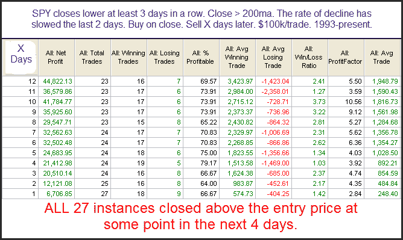

<!--yml
category: 未分类
date: 2024-05-18 13:11:05
-->

# Quantifiable Edges: Based On This Setup SPY Has Always Bounced In The Past

> 来源：[http://quantifiableedges.blogspot.com/2009/10/based-on-this-setup-spy-has-always.html#0001-01-01](http://quantifiableedges.blogspot.com/2009/10/based-on-this-setup-spy-has-always.html#0001-01-01)

I’ve shown before how a deceleration in selling often suggests a bullish edge. A study from

[the Quantifinder](http://www.quantifiableedges.com/quantifinderinfo.html)

last night illustrated this concept. It first appeared in the June 18, 2009 blog. I’ve updated the results below.

Most impressive about this one is the 100% consistency of the bounce. That’s an impressive feat with a sample size so ample.