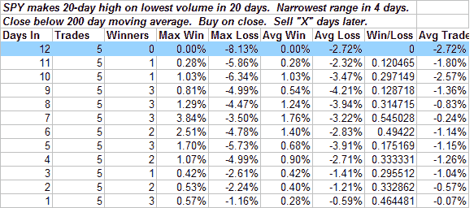

<!--yml
category: 未分类
date: 2024-05-18 08:22:52
-->

# Quantifiable Edges: Bearish Bar But Fed Looming

> 来源：[http://quantifiableedges.blogspot.com/2008/04/bearish-bar-but-fed-looming.html#0001-01-01](http://quantifiableedges.blogspot.com/2008/04/bearish-bar-but-fed-looming.html#0001-01-01)

[Last week](http://quantifiableedges.blogspot.com/2008/04/is-buying-drying-up.html)

I showed how very low volume in a short-term uptrend is a negative. It happened again today along with some other action that hasn’t been constructive historically. Here’s a quick look at what happens when several negative all come together:

For those who would like to review the previous instances they were 6/2/94, 11/6/00, 11/13/01, 10/28/02, 11/29/02.

You don’t want to read too much into just 5 instances, but the formation has been quite bearish in the past. Of course as I mentioned last night, the Fed announcement Wednesday will likely have a larger influence on short-term direction than historical precedents.