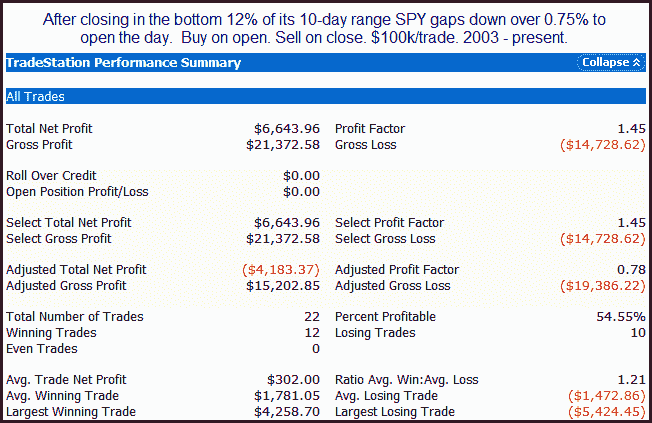
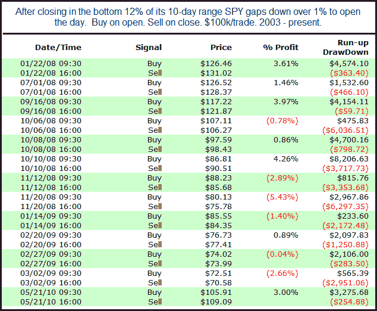

<!--yml
category: 未分类
date: 2024-05-18 12:57:56
-->

# Quantifiable Edges: Big Gaps Down When SPY Is Near Recent Lows

> 来源：[http://quantifiableedges.blogspot.com/2010/06/big-gaps-down-when-spy-is-near-recent.html#0001-01-01](http://quantifiableedges.blogspot.com/2010/06/big-gaps-down-when-spy-is-near-recent.html#0001-01-01)

A little over a week ago I showed a study that

[examined large gaps up from high levels](http://quantifiableedges.blogspot.com/2010/06/large-gap-up-from-high-level.html)

. The results were very compelling and suggested a strong downside edge. Today we are presented with a similar situation in the opposite direction. So this morning I ran some tests that looked at large gaps down from a low area. Below is one example typical of what I saw:

Perhaps a mild upside edge could be found, but certainly nothing as compelling as last week's study. Results were volatile as well, with the average

intraday drawdown

over 1.6% and the average run-up over 2%.

Below I tightened the requirements to a 1% gap and showed all instances. Results were similar - just with fewer instances.

Bottom line is there may be a slight upside edge, but the direction is certainly no layup. No matter the direction be prepared for some volatile action today.